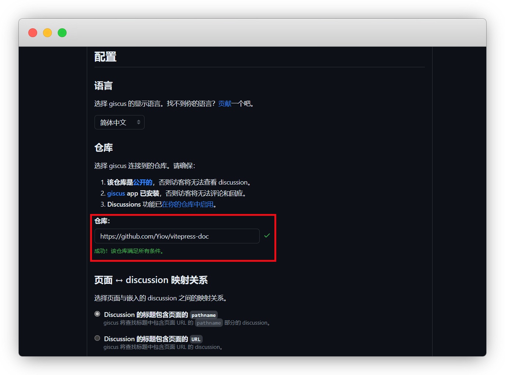
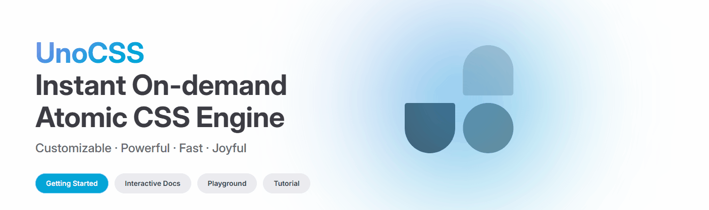
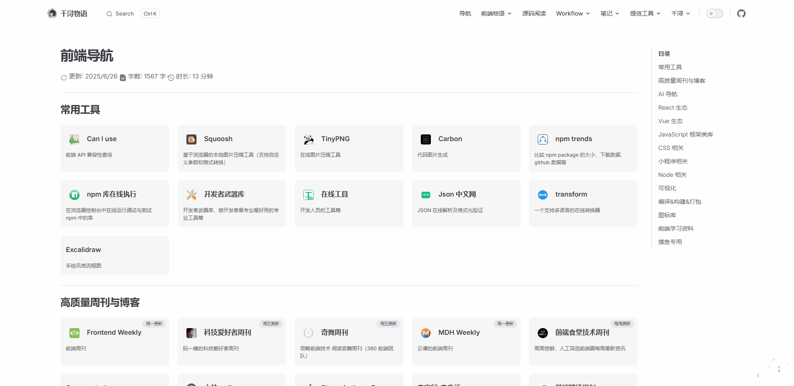
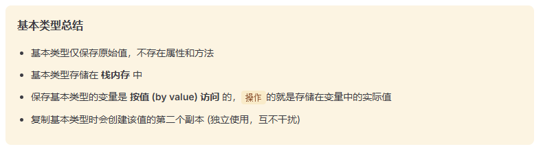
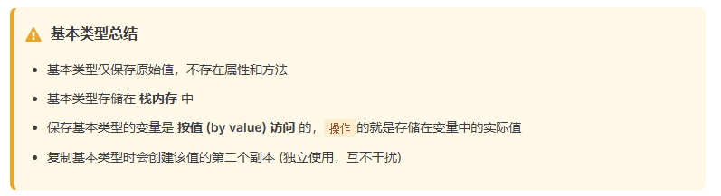
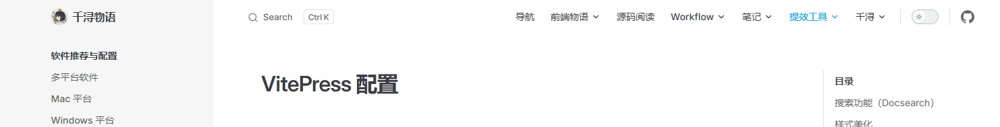
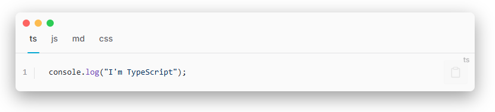

# VitePress 配置

## 搜索功能（Docsearch）

`VitePress` 的内部集成有`Algolia` 的 `Algolia DocSearch` ，我们可以直接配置使用。

配置略有些繁琐，这里就不详细说明了，详见[给 VitePress 添加 algolia 搜索](https://zhuanlan.zhihu.com/p/668000413)

## 评论（Giscus）

### 安装 giscus

Giscus 是一个基于 GitHub Discussion 的评论系统，启用简便

进 Giscus App 官网：https://github.com/apps/giscus

点击 `Install` 安装


选择 `Only select repositories`，再指定一个你想开启讨论的仓库

::: tip 注意
仓库必须是公开的，私有的不行

想单独放评论，新建一个也可
:::


::: tip 查看
完成后可以在个人头像-设置-应用 `Applications` 中看到
:::

### 开启讨论

因为 giscus 会把评论数据都放到讨论 `discussions` 中

我们进入要开启讨论的仓库，点设置 - 勾选讨论 `Settings - discussions`


### 生成数据

进入官网：https://giscus.app/zh-CN

输入自己的仓库链接，满足条件会提示可用



下拉到 Discussion 分类推荐选 `General` ，懒加载评论也可以勾选下

::: details 关于讨论的类型，分类如下
查看了一下 [Github 的讨论文档](https://docs.github.com/zh/discussions/managing-discussions-for-your-community/managing-categories-for-discussions#about-categories-for-discussions)

|     类别      |    中文    |          说明          |
| :-----------: | :--------: | :--------------------: |
| Announcements |    公告    | 每次评论都会推送所有人 |
|    General    |    常规    |       开放式讨论       |
|     Ideas     |    想法    |       开放式讨论       |
|     Polls     |    投票    |      可投票与讨论      |
|      Q&A      |    问答    |        问答形式        |
| Show and tell | 展示和说明 |       开放式讨论       |

:::


下方就自动生成了你的关键数据


其中 `data-repo` 、 `data-repo-id` 、 `data-category` 和 `data-category-id` 这 4 个是我们的关键数据

```js{2-5}
<script src="https://giscus.app/client.js"
        data-repo="github repository" // [!code focus:4]
        data-repo-id="R_******"
        data-category="General"
        data-category-id="DIC_******"
        data-mapping="pathname"
        data-strict="0"
        data-reactions-enabled="1"
        data-emit-metadata="0"
        data-input-position="bottom"
        data-theme="preferred_color_scheme"
        data-lang="zh-CN"
        data-loading="lazy"
        crossorigin="anonymous"
        async>
</script>
```

### 安装使用

有能力的可以用官方给的 js 数据封装

我这里用 [@T-miracle/vitepress-plugin-comment-with-giscus](https://github.com/T-miracle/vitepress-plugin-comment-with-giscus) 的插件

::: code-group

```sh [pnpm]
pnpm add -D vitepress-plugin-comment-with-giscus
```

```sh [yarn]
yarn add -D vitepress-plugin-comment-with-giscus
```

```sh [npm]
npm install vitepress-plugin-comment-with-giscus
```

```sh [bun]
bun add -D vitepress-plugin-comment-with-giscus
```

:::

在 `.vitepress/theme/index.ts` 中填入下面代码

并将我们之前获取的 4 个关键数据填入，其他保持默认保存

```ts{3-4,10-31}
// .vitepress/theme/index.ts
import DefaultTheme from 'vitepress/theme';
import giscusTalk from 'vitepress-plugin-comment-with-giscus';
import { useData, useRoute } from 'vitepress';

export default {
  extends: DefaultTheme,

  setup() {
    // Get frontmatter and route
    const { frontmatter } = useData();
    const route = useRoute();

    // giscus配置
    giscusTalk({
      repo: 'your github repository', //仓库
      repoId: 'your repository id', //仓库ID
      category: 'Announcements', // 讨论分类
      categoryId: 'your category id', //讨论分类ID
      mapping: 'pathname',
      inputPosition: 'bottom',
      lang: 'zh-CN',
      },
      {
        frontmatter, route
      },
      //默认值为true，表示已启用，此参数可以忽略；
      //如果为false，则表示未启用
      //您可以使用“comment:true”序言在页面上单独启用它
      true
    );

}
```

**滑动到最底部即可查看效果**

::: details 如果某一页不想启用
我们可以在当前页使用 `Frontmatter` 关闭

```yaml
---
comment: false
---
```

:::

## 样式美化

主要是针对 `vitePress` 做的一些样式方面的美化，包括首页彩虹样式动画，以及 `markdown`方面的引用、容器、记号笔、代码块和代码组等功能的美化。

### 彩虹背景动画

在 [UnoCSS](https://unocss.dev/) 首页中，它的标题和图片背景有类似彩虹的渐变色动画

具体效果可以看下面这个 `GIF` 图：



效果还是挺明显的：左侧 `UnoCSS` 文字、`Getting Started` 按钮以及右侧 `Logo` 都有彩虹渐变背景的动画效果

我们同样可以实现这种效果

在 `theme/style` 新建 `rainbow.scss` 文件，在 `rainbow.scss` 中 写一个名为 `rainbow` 关键帧

::: details 点我查看代码
<<< @/.vitepress/theme/styles/rainbow.scss
:::

接着使用这个关键帧

在 `theme/index.ts` 中写入代码

```ts{2-3,10-17,22-39}
/* .vitepress/theme/index.ts */ // [!code focus:3]
// 彩虹背景动画样式
let homePageStyle: HTMLStyleElement | undefined

export default {
  extends: DefaultTheme,

  enhanceApp({app , router }) {
    // [!code focus:8]
    // 彩虹背景动画样式
    if (typeof window !== 'undefined') {
      watch(
        () => router.route.data.relativePath,
        () => updateHomePageStyle(location.pathname === '/'),
        { immediate: true },
      )
    }

  },
}
// [!code focus:18]
// 彩虹背景动画样式
function updateHomePageStyle(value: boolean) {
  if (value) {
    if (homePageStyle) return

    homePageStyle = document.createElement('style')
    homePageStyle.innerHTML = `
    :root {
      animation: rainbow 12s linear infinite;
    }`
    document.body.appendChild(homePageStyle)
  } else {
    if (!homePageStyle) return

    homePageStyle.remove()
    homePageStyle = undefined
  }
}

```

这段代码的逻辑是这样的：

1. 先定义一个动画样式变量 `homePageStyle` ，类型为 `HTMLStyleElement`
2. 创建一个名为 `updateHomePageStyle` 的函数，函数的作用是根据传入的参数 `value` 来判断是否需要添加动画样式。如果 `value` 为真并且 `homePageStyle` 不存在，则创建一个新的样式元素 `homePageStyle` ，并设置样式内容为动画样式，使用我们之前创建的关键帧 `rainbow `。然后将 `homePageStyle` 添加到 `body` 元素中。如果 `value` 为假，则移除样式元素
3. 之后使用 `watch` 监听 路由是否变化，如果路由变化，则执行 `updateHomePageStyle 函数`，在当前页面是首页的情况下，给函数传 `true`，否则传 `false`

::: details 为什么不直接在全局样式中写 animation ?

**主要是性能方面的考虑**

如果直接在全局 `CSS` 中添加动画：

```css
:root {
  animation: rainbow 12s linear infinite;
}
```

那么这个动画会在所有页面都运行，即使你已经离开首页`（/）`进入其他页面。这会导致：

- ❌ 动画资源浪费（即使不需要该动画时也持续运行）

- ❌ 可能影响性能（尤其是复杂的动画或低端设备上）

我们当前代码中通过 `Vue` 的 `watch` 监听路由变化，并调用 `updateHomePageStyle(location.pathname === "/") `实现了以下效果：

- ✔️ 按需加载动画,提升性能

  只在访问首页 `/` 时才插入带有动画的 `<style>` 标签，当用户浏览其他页面时，动态移除动画样式，这样可以避免不必要的资源消耗，提升性能

- ✔️ 精确控制动画生命周期

  通过手动控制动画样式的添加与移除，可以确保动画状态始终与当前页面匹配，避免出现“页面已切换但动画仍在运行”的不一致行为

💡 **类似场景举例**

这种做法常见于以下场景：

- 首页背景动画
- 页面加载特效
- 某些页面独有的交互动画
- `A/B` 测试中的特定样式注入

:::

然后在`index.scss`中引入`rainbow.scss`

```css
/* .vitepress/theme/style/index.scss */
@import "./rainbow.scss";
```

`rainbow.scss`文件只是定义了一个动画关键帧，接下来还需要写一点样式去应用这个关键帧，去覆盖掉首页的背景图，实现线性渐变的彩虹动画效果

在 `theme/style` 新建 `var.scss` 文件，在 `var.scss` 中写入以下代码：

```scss
/**
 * Component: Home
 * -------------------------------------------------------------------------- */
:root {
  --vp-home-hero-name-color: transparent;
  --vp-home-hero-name-background: -webkit-linear-gradient(
    120deg,
    var(--vp-c-brand-1) 30%,
    var(--vp-c-brand-next)
  );
  --vp-home-hero-image-background-image: linear-gradient(
    -45deg,
    var(--vp-c-brand-1) 30%,
    var(--vp-c-brand-next)
  );
  --vp-home-hero-image-filter: blur(80px);
}

@media (min-width: 640px) {
  :root {
    --vp-home-hero-image-filter: blur(120px);
  }
}

@media (min-width: 960px) {
  :root {
    --vp-home-hero-image-filter: blur(120px);
  }
}
```

最后在`index.scss`中引入这个文件

```css
/* .vitepress/theme/style/index.scss */
@import "./var.scss";
```

::: tip

以下所有的样式美化都是在`.vitepress/theme/style/index.scss`中引入的，为了让所写的样式美化生效，在`docs\.vitepress\theme\index.ts`中需要引入这个`index.scss`文件
:::

### 深浅模式切换动画

在官方的文档中，有这么一个 [深浅模式切换的动画](https://vitepress.dev/zh/guide/extending-default-theme#on-appearance-toggle)


有点意思，~~我们直接抄过来~~

::: code-group

```vue{4-40,50-77} [MyLayout.vue]
<!-- .vitepress/theme/MyLayout.vue -->
<script setup lang="ts">
import DefaultTheme from 'vitepress/theme'
import { useData } from 'vitepress'
import { nextTick, provide } from 'vue'

const { isDark } = useData()

const enableTransitions = () =>
  'startViewTransition' in document &&
  window.matchMedia('(prefers-reduced-motion: no-preference)').matches

provide('toggle-appearance', async ({ clientX: x, clientY: y }: MouseEvent) => {
  if (!enableTransitions()) {
    isDark.value = !isDark.value
    return
  }

  const clipPath = [
    `circle(0px at ${x}px ${y}px)`,
    `circle(${Math.hypot(
      Math.max(x, innerWidth - x),
      Math.max(y, innerHeight - y)
    )}px at ${x}px ${y}px)`
  ]

  await document.startViewTransition(async () => {
    isDark.value = !isDark.value
    await nextTick()
  }).ready

  document.documentElement.animate(
    { clipPath: isDark.value ? clipPath.reverse() : clipPath },
    {
      duration: 300,
      easing: 'ease-in',
      pseudoElement: `::view-transition-${isDark.value ? 'old' : 'new'}(root)`
    }
  )
})
</script>

<template>
  <DefaultTheme.Layout>
    <!-- 这里是已有的插槽组件 -->
  </DefaultTheme.Layout>
</template>

<style>
::view-transition-old(root),
::view-transition-new(root) {
  animation: none;
  mix-blend-mode: normal;
}

::view-transition-old(root),
.dark::view-transition-new(root) {
  z-index: 1;
}

::view-transition-new(root),
.dark::view-transition-old(root) {
  z-index: 9999;
}

/* 恢复原始开关按钮 */
/* .VPSwitchAppearance {
  width: 22px !important;
} */

.VPSwitchAppearance .check {
  transform: none !important;
}

/* 修正因视图过渡导致的按钮图标偏移 */
.VPSwitchAppearance .check .icon {
  top: -2px;
}
</style>
```

:::

然后还需要在`.vitepress/theme/index.ts`中配置下

```ts{3-5,10}
// .vitepress/theme/index.ts
import DefaultTheme from 'vitepress/theme'
import { h } from 'vue' // h函数
// 组件1
import MyLayout from "./components/MyLayout.vue";

export default {
  extends: DefaultTheme,
  Layout() {
    return h(MyLayout, null, {

      // 这里是其他插槽组件

    })
  }
}
```

看下效果：



还不赖

### 引用颜色更改

在 Markdown 中，我们常用的引用符号是 `>`，关于引用的样式我们我们可以稍微改动一下

在 `theme/style` 新建 `blockquote.css` 文件，并且复制下面代码，粘贴到 `blockquote.css` 中

```css
/* .vitepress/theme/style/blockquote.css */
.vp-doc blockquote {
  border-radius: 10px;
  padding: 18px 20px 20px 15px;
  position: relative;
  background-color: var(--vp-c-gray-soft);
  border-left: 6px solid var(--vp-c-green-2);
}
```

然后在 `index.scss` 中引入生效

```css
/* .vitepress/theme/style/index.scss */
@import "./blockquote.css";
```

输入：

```md
> 更新时间：2024 年
```

输出：

> 更新时间：2024 年

### 容器颜色

`vitePress` 中 `tip`、`warning`、`danger` 等容器的样式不太好看，这里我们参考[Vuepress/hope 主题的容器颜色](https://theme-hope.vuejs.press/zh/guide/markdown/stylize/hint.html#%E6%BC%94%E7%A4%BA)去实现一套我们自己的方案

在 `theme/style` 新建 `custom-block.css` 文件，复制下面代码，粘贴到 `custom-block.css` 中

::: details 点我查看代码

<<< @/.vitepress/theme/styles/custom-block.scss

:::

---

更改之前效果：



更改之后效果：



更改之后加了左边框、图标，看着好看多了

### 导航毛玻璃

在 `theme/style` 文件夹，然后新建 `blur.css` 并填入如下代码

```css
/* .vitepress\theme\style\blur.css */
:root {
  /* 首页下滑后导航透明 */
  .VPNavBar:not(.has-sidebar):not(.home.top) {
    background-color: rgba(255, 255, 255, 0);
    backdrop-filter: blur(10px);
  }

  /* 搜索框透明 */
  .DocSearch-Button {
    background-color: rgba(255, 255, 255, 0);
    backdrop-filter: blur(10px);
  }

  /* 文档页侧边栏顶部透明 */
  .curtain {
    background-color: rgba(255, 255, 255, 0);
    backdrop-filter: blur(10px);
  }

  @media (min-width: 960px) {
    /* 文档页导航中间透明 */
    .VPNavBar:not(.home.top) .content-body {
      background-color: rgba(255, 255, 255, 0);
      backdrop-filter: blur(10px);
    }
  }

  /* 移动端大纲栏透明 */
  .VPLocalNav {
    background-color: rgba(255, 255, 255, 0);
    backdrop-filter: blur(10px);
  }
}
```

最后引入 `index.scss` 中 即可看到效果

```css
/* style/index.scss */
@import "./blur.css";
```

---

更改之前效果：


更改之后效果：



相比较更改之前导航栏纯白的背景，更改之后的导航栏有一个毛玻璃的效果，体验感会更好

### 记号笔

在某些整段的文字中，我们可以用记号笔，划出重点。这里的记号笔效果参考了[尤大的个人主页](https://evanyou.me/)

在 `theme/style` 新建 `marker.css` 文件，将下面代码，复制粘贴到 `marker.css` 中

```css [marker.css]
/* .vitepress/theme/style/marker.css */

/* 尤雨溪主页记号笔效果 不喜欢可自行调整 */
.marker {
  white-space: nowrap;
  position: relative;
}

.marker:after {
  content: "";
  position: absolute;
  z-index: -1;
  top: 66%;
  left: 0em;
  right: 0em;
  bottom: 0;
  transition: top 200ms cubic-bezier(0, 0.8, 0.13, 1);
  background-color: rgba(79, 192, 141, 0.5);
}

.marker:hover:after {
  top: 0%;
}
```

然后在 `index.scss` 中引入生效

```css
/* .vitepress/theme/style/index.scss */
@import "./marker.css";
```

输入：

```md
<sapn class="marker">这里是尤雨溪的主页样式，鼠标放在我上面看效果</sapn>
```

输出：

<sapn class="marker">这里是尤雨溪的主页样式，鼠标放在我上面看效果</sapn>

---

### 代码块

将代码块改成 Mac 风格，三个小圆点

在 `.vitepress/theme/style` 目录新建一个 `vp-code.css` 文件，复制下面代码，粘贴到 `vp-code.css` 保存

```css
/* .vitepress/theme/style/vp-code.css */

/* 代码块：增加留空边距 增加阴影 */
.vp-doc div[class*="language-"] {
  box-shadow: 0 10px 30px 0 rgb(0 0 0 / 40%);
  padding-top: 20px;
}

/* 代码块：添加macOS风格的小圆点 */
.vp-doc div[class*="language-"]::before {
  content: "";
  display: block;
  position: absolute;
  top: 12px;
  left: 12px;
  width: 12px;
  height: 12px;
  background-color: #ff5f56;
  border-radius: 50%;
  box-shadow: 20px 0 0 #ffbd2e, 40px 0 0 #27c93f;
  z-index: 1;
}

/* 代码块：下移行号 隐藏右侧竖线 */
.vp-doc .line-numbers-wrapper {
  padding-top: 40px;
  border-right: none;
}

/* 代码块：重建行号右侧竖线 */
.vp-doc .line-numbers-wrapper::after {
  content: "";
  position: absolute;
  top: 40px;
  right: 0;
  border-right: 1px solid var(--vp-code-block-divider-color);
  height: calc(100% - 60px);
}

.vp-doc div[class*="language-"].line-numbers-mode {
  margin-bottom: 20px;
}
```

然后在 `index.scss` 中引入生效

```css
/* .vitepress/theme/style/index.scss */
@import "./vp-code.css";
```

更改之前效果：


更改之后效果:


更改之后加了边框阴影和顶部左侧的小圆点，更好看了

---

### 代码组

在更改代码块的基础上，更改代码组样式

在 `.vitepress/theme/style` 目录新建一个 `vp-code-group.css` 文件，复制下面代码，粘贴到 `vp-code-group.css` 保存

```css
/* .vitepress/theme/style/vp-code-group.css */

/* 代码组：tab间距 */
.vp-code-group .tabs {
  padding-top: 20px;
}

/* 代码组：添加样式及阴影 */
.vp-code-group {
  color: var(--vp-c-black-soft);
  border-radius: 8px;
  box-shadow: 0 10px 30px 0 rgb(0 0 0 / 40%);
}

/* 代码组：添加macOS风格的小圆点 */
.vp-code-group .tabs::before {
  content: " ";
  position: absolute;
  top: 12px;
  left: 12px;
  height: 12px;
  width: 12px;
  background: #fc625d;
  border-radius: 50%;
  box-shadow: 20px 0 #fdbc40, 40px 0 #35cd4b;
}

/* 代码组：修正倒角、阴影、边距 */
.vp-code-group div[class*="language-"].vp-adaptive-theme.line-numbers-mode {
  border-radius: 8px;
  box-shadow: none;
  padding-top: 0px;
}

/* 代码组：隐藏小圆点 */
.vp-code-group div[class*="language-"].vp-adaptive-theme.line-numbers-mode::before {
  display: none;
}

/* 代码组：修正行号位置 */
.vp-code-group .line-numbers-mode .line-numbers-wrapper {
  padding-top: 20px;
}

/* 代码组：修正行号右侧竖线位置 */
.vp-code-group .line-numbers-mode .line-numbers-wrapper::after {
  top: 24px;
  height: calc(100% - 45px);
}

/* 代码组（无行号）：修正倒角、阴影、边距 */
.vp-code-group div[class*="language-"].vp-adaptive-theme {
  border-radius: 8px;
  box-shadow: none;
  padding-top: 0px;
}

/* 代码组（无行号）：隐藏小圆点 */
.vp-code-group div[class*="language-"].vp-adaptive-theme::before {
  display: none;
}
```

然后在 `index.scss` 中引入生效

```css
/* .vitepress/theme/style/index.scss */
@import "./vp-code-group.css";
```

## 插件

使用插件实现一些其他效果。比如使用 `medium-zoom` 实现缩放图片，使用 `vitepress-plugin-group-icons` 增加代码组图标，使用 `nprogress-v2` 实现切换进度条效果 。

### 图片缩放

主要是使用 [medium-zoom](https://github.com/francoischalifour/medium-zoom) ，参考了[Allow images to be zoomed in on click](https://github.com/vuejs/vitepress/issues/854)

::: code-group

```sh [pnpm]
pnpm add -D medium-zoom
```

```sh [yarn]
yarn add -D medium-zoom
```

```sh [npm]
npm install medium-zoom
```

```sh [bun]
bun add -D medium-zoom
```

:::

在 `.vitepress/theme/index.ts` 添加如下代码，并保存

```ts{4-6,11-24}
// .vitepress/theme/index.ts
import DefaultTheme from 'vitepress/theme'

import mediumZoom from 'medium-zoom';
import { onMounted, watch, nextTick } from 'vue';
import { useRoute } from 'vitepress';

export default {
  extends: DefaultTheme,

  setup() {
    const route = useRoute();
    const initZoom = () => {
      // mediumZoom('[data-zoomable]', { background: 'var(--vp-c-bg)' }); // 默认
      mediumZoom('.main img', { background: 'var(--vp-c-bg)' }); // 不显式添加{data-zoomable}的情况下为所有图像启用此功能
    };
    onMounted(() => {
      initZoom();
    });
    watch(
      () => route.path,
      () => nextTick(() => initZoom())
    );
  },

}
```

点击图片后，还是能看到导航栏，加一个遮挡样式

在 `theme/style` 新建 `medium-zoom.scss` 加入如下代码:

```css
/* .vitepress/theme/style/medium-zoom.scss */
:root {
  --medium-zoom-z-index: 100;
  --medium-zoom-c-bg: var(--vp-c-bg);
}

.medium-zoom-overlay {
  /* override element style set by medium-zoom script */
  z-index: var(--medium-zoom-z-index);
  background-color: var(--medium-zoom-c-bg) !important;
}

.medium-zoom-overlay ~ img {
  z-index: calc(var(--medium-zoom-z-index) + 1);
}
```

然后在 `index.scss` 中引入生效

```css
/* .vitepress/theme/style/index.scss */
@import "./medium-zoom.scss";
```

更改之后效果


### 代码组图标

使用的插件是 [@yuyinws/vitepress-plugin-group-icons](https://github.com/yuyinws/vitepress-plugin-group-icons)

参照教程安装：https://vpgi.vercel.app/

::: code-group

```sh [pnpm]
pnpm add -D vitepress-plugin-group-icons
```

```sh [yarn]
yarn add -D vitepress-plugin-group-icons
```

```sh [npm]
npm install vitepress-plugin-group-icons
```

```sh [bun]
bun add -D vitepress-plugin-group-icons
```

:::

然后在 `config.mts` 中配置

```ts{3,8-10,13-17}
// .vitepress/config.mts
import { defineConfig } from 'vitepress'
import { groupIconMdPlugin, groupIconVitePlugin } from 'vitepress-plugin-group-icons' // [!code focus]

export default defineConfig({

  markdown: {
    config(md) { // [!code focus:3]
      md.use(groupIconMdPlugin) //代码组图标
    },
  },

  vite: { // [!code focus:5]
    plugins: [
      groupIconVitePlugin() //代码组图标
    ],
  },

})
```

最后还需要再 `index.ts` 中引入样式

```ts{4}
// .vitepress/theme/index.ts
import DefaultTheme from 'vitepress/theme'

import 'virtual:group-icons.css' //代码组样式 // [!code focus]

export default {
  extends: DefaultTheme,
}
```

使用时，请确保代码后有对应的文字触发，如 `sh [pnpm]` 表示这一段代码块是 `pnpm` 的代码块

````md{2,6,10}
::: code-group
```sh [pnpm]
pnpm -v
```

```sh [yarn]
yarn -v
```

```sh [bun]
bun -v
```
:::
````

::: code-group

```sh [pnpm]
pnpm -v
```

```sh [yarn]
yarn -v
```

```sh [bun]
bun -v
```

:::

此插件已经涵盖了所有的常用图标，但是有一个问题：如果我们想给代码为 `js` 的块添加图标，必须写文件名，如：

````md{2,6,10}
::: code-group
```ts [a.ts]
console.log("I'm TypeScript");
```

```js [b.js]
console.log("I'm JavaScript");
```

```md [c.md]
Markdown 图标演示
```

```css [d.css]
h1 {
  background: red;
}
```
:::
````

这是因为在插件的内部逻辑中，`ts`、`js`等图标是根据文件类型去判断添加的。我理想的效果是只需要写文件类型就行了，就比如`js [js]`

那么该如何自定义呢， 我们需要在`config.mts` 中配置:

```ts{3,15-36}
// .vitepress/config.mts
import { defineConfig } from 'vitepress'
import { groupIconMdPlugin, groupIconVitePlugin, localIconLoader } from 'vitepress-plugin-group-icons' // [!code focus]

export default defineConfig({

  markdown: {
    config(md) {
      md.use(groupIconMdPlugin) //代码组图标
    },
  },

  vite: {
    plugins: [
      groupIconVitePlugin({ // [!code focus:22]
       customIcon: {
          mts: "vscode-icons:file-type-typescript",
          cts: "vscode-icons:file-type-typescript",
          ts: "vscode-icons:file-type-typescript",
          tsx: "vscode-icons:file-type-typescript",
          mjs: "vscode-icons:file-type-js",
          cjs: "vscode-icons:file-type-js",
          json: "vscode-icons:file-type-json",
          js: "vscode-icons:file-type-js",
          jsx: "vscode-icons:file-type-js",
          md: "vscode-icons:file-type-markdown",
          py: "vscode-icons:file-type-python",
          ico: "vscode-icons:file-type-favicon",
          html: "vscode-icons:file-type-html",
          css: "vscode-icons:file-type-css",
          scss: "vscode-icons:file-type-scss",
          yml: "vscode-icons:file-type-light-yaml",
          yaml: "vscode-icons:file-type-light-yaml",
          php: "vscode-icons:file-type-php",
        },
      })
    ],
  },

})
```

最后总体看下使用插件增加代码组图标，更改前后的效果

更改前



更改后


---

### 切换路由进度条

当切换页面，顶部会显示进度条，使用的是 [@Skyleen77/nprogress-v2](https://github.com/Skyleen77/nprogress-v2)，使用方法还是挺简单的

先安装 `nprogress-v2`

::: code-group

```sh [pnpm]
pnpm add -D nprogress-v2
```

```sh [yarn]
yarn add -D nprogress-v2
```

```sh [npm]
npm install nprogress-v2
```

```sh [bun]
bun add -D nprogress-v2
```

:::

然后再 `.vitepress/theme/index.ts` 中配置，即可生效

```ts
// .vitepress/theme/index.ts

import { inBrowser } from "vitepress";
import { NProgress } from "nprogress-v2/dist/index.js"; // 进度条组件
import "nprogress-v2/dist/index.css"; // 进度条样式
export default {
  extends: DefaultTheme,
  enhanceApp({ app, router }) {
    // 切换路由进度条
    if (inBrowser) {
      NProgress.configure({ showSpinner: false });

      router.onBeforeRouteChange = () => {
        NProgress.start(); // 开始进度条
      };
      router.onAfterRouteChange = () => {
        NProgress.done(); // 停止进度条
      };
    }
  },
};
```

更改后效果


## 组件

一些应用到`vitepress` 中的自定义组件，比如首页文字下滑线，五彩纸屑，鼠标粒子效果，字数以及阅读时间等组件

### 首页文字下划线

[首页文字](../../index.md) 的下划线，是利用了 [@Theo-Messi](https://github.com/Theo-Messi/tm-fe/) 的组件

在 `theme/components` 文件夹，创建 `HomeUnderline.vue`，写入入如下代码：

::: code-group

```vue [HomeUnderline.vue]
<script setup lang="ts">
import { useData } from "vitepress";
import { onMounted, onUnmounted } from "vue";

let sourceElement: Element | null = null;
let placeholder: Comment | null = null;

onMounted(() => {
  const target = document.querySelector(".VPHero .text");
  sourceElement = document.querySelector("#hero-text");
  if (target && sourceElement) {
    placeholder = document.createComment("hero-text-placeholder");
    sourceElement.before(placeholder);
    target.innerHTML = "";
    target.appendChild(sourceElement);
  }
});
onUnmounted(() => {
  if (placeholder && sourceElement) {
    placeholder.parentNode?.replaceChild(sourceElement, placeholder);
  }
});
const { frontmatter: fm } = useData();
</script>

<template>
  <span id="hero-text">
    <span class="hero-text"
      >{{ fm.hero?.text }}
      <svg
        class="hero-svg"
        xmlns="http://www.w3.org/2000/svg"
        width="240"
        height="11"
        viewBox="0 0 240 11"
        fill="currentColor"
        aria-hidden="true"
        focusable="false"
      >
        <path
          d="M20.766 10.187c.939-.024.386-.885.552-1.401 1.105-.301.553.626.962 1.061.685-.263 1.171-1.1 1.696-1.085.044.144.15.191.044.378.697-.736 2.21-.134 2.995-1.052a.55.55 0 0 1 .127.215 3.35 3.35 0 0 1-.204-1.204c.42-.034.751-.593.94 0-.255 0-.266.23-.377.416l.426-.273c.448.813-.586.316-.553.927.84-.306 1.802-1.037 2.476-.831.182.803-1.525.339-.608 1.023l-1.033-.268c.85 1.248-.625-.057.171 1.276 1.348.177 1.47-.478 2.818-.3.276-.479-.132-.66.144-1.124 1.857-.885 1.602 1.984 2.94.846.337-.555.42-1.582 1.442-1.08l-.276.889c1.298.038.668-1.348 2.06-.784-.226.368-1.005.344-.8.444.917.689.59-.545 1.27-.569l.16.827c1.371-.181 2.863-.827 4.388-1.037-.072.249-.326.512.044.746 1.912-.478 4.123-.058 6.007.368l.68-.727c.05.015.095.04.132.074a.275.275 0 0 1 .077.118c.014.044.015.091.004.136a.27.27 0 0 1-.07.122c.74.243 0-.445.354-.732.414-.062.552.383.315.603 1.248-.636 3.586-1.401 4.973-.694l-.254.22c1.06.249 1.105-1.477 2.127-.855l-.182.129c2.293.23 4.785-.478 6.564.52.293-1.017 2.272.393 2.365-1.022 1.327.664.967.927 2.813 1.348.492.052.702-.899 1.299-1.061l.044.731.79-.794.47.87.552-.205a.66.66 0 0 1-.332-.2.517.517 0 0 1-.132-.33c.873-.354 2.177.477 2.21.831l2.078-.679c-.039.301-.387.411-.657.607 1.105-.779.226.77 1.232.053-.144-.163.06-.44.077-.588.553.435 1.691.416 2.547.205l-.149.512c1.558.1 3.271-.31 5.018-.335-.636-.224-.514-1.109 0-1.204l.226.774c.32-.478-.552-.282.122-.884.652.076.464.875.094 1.138l.784-.287c.056.23-.127.358-.165.655.309-.478 1.387.75 1.834-.096l.05.23c1.746-.03 2.53-.316 3.95-.383 0-.674.553-.535.984-1.085 1.05.196 2.21.707 3.482.63.878-.343.243-.568.635-.955.077.612 1.332.535.69.985a15.353 15.353 0 0 0 3.83-.68c-.21-.243-.447-.353-.331-.563a.738.738 0 0 1 .275.01c.09.02.173.058.245.11a.58.58 0 0 1 .169.188c.04.072.061.151.062.232l-.088.067c2.127-.956 4.973 1.706 6.669.41l-.099.068 1.763-.684c.817.1-.481.478.127.842 1.9-1.043 3.022.12 4.586-.574 1.243 1.793 4.327-.167 5.979.956l-.1-.42c.426-.421.52.234.835.33-.05-.33-.464-.378-.205-.613 3.598-.545 7.438.598 11.129.956 1.348.11.757-2.203 2.465-1.195l-.481.794c2.719-.956 5.564 0 8.233-.77-.154.182-.16.416-.425.416.552.574 2.083.034 2.094-.435.42.053.1.425.354.665.552.339 1.42-.732 1.718-.158.05.09-.16.186-.265.23.37-.278 1.719.076 1.365-.589 1 .32 1.917-.287 2.713.105.553-.736 1.713.364 1.884-.683-.077 1.08 1.752.875 2.387.377-.215.326.553.345.299.794.718 0 1.381-.206 1.265-.76 1.315 1.305 2.686-1.018 3.415.645a45.888 45.888 0 0 1 6.078-1.17c-.082 1.075-2.138.09-2.066 1.218 1.834-.425 2.906-1.343 4.719-1.066.47.153-.276.478-.437.65 1.835-.43 3.537.148 5.172-.42 0 .1-.182.21-.348.291.321-.033.741.167.713-.325l-.315.13c-.497-.718 1.304-1.468 1.365-1.841-.553 1.396 1.602.377.707 2.137a.73.73 0 0 0 .337-.263.58.58 0 0 0 .1-.383c.315.1.409.297.083.665 1.155-.254.757-.78 1.801-.75 0 .233-.221.324-.337.601.553-.478 1.078-.908 1.951-.697-.056.143.044.33-.216.325 1.509-.048 2.603-1.195 4.249-.722-.513 1.023.553.349.625 1.243l.895-.254-.348-.44c.785.034 1.492-.602 2.155-.296l-.591.354 1.47-.139-.824-.354c.807-.444-.055-1.132.978-.86-.21.086.785.029 1.177.56.398-.278.801-.57 1.376-.335.138.291-.149.984-.055 1.176.398-.736 1.834-.168 2.337-.956-.143.227-.192.49-.138.745l.337-.597c.359.2.409.296.337.669 1.105.134-.309-1.138.967-.626-.105.048-.055.138-.27.23 1.287.277 2.519-.335 3.702 0 .326.903-1.05.195-.669.955 1.724-.129 3.592-.999 5.25-.74l-.31-.106c.277-1.262 1.221.66 2.083.086-.21.086-.298.693-.237.555 1.105.234 2.343-.249 4.083-.603l-.226.32c.657.311 1.763.216 2.481.383.226-.315.641-.253.403-.731 2.166 1.912 4.305-.89 6.228.726-.238 0-.553.268-.387.273l1.702-.244c-.111-.554-.21-.34-.553-.784.124-.163.292-.298.489-.392.198-.094.419-.145.644-.148-.774.34-.028.884.287 1.205-.049-.173.072-.354.05-.526.846 1.008.199-1.11 1.376-.407l-.077.287c.458-.134.889-.478 1.37-.401.177.645-.492.282-.552.803.685 0 1.403-1.162 1.994-.507-.298.167-.718.158-1.016.325.641.77.729.583 1.221.717h-.044l1.138.378-.282-.21c.928-1.635 1.752-.25 2.951-1.3-1.166.994-.21.592-.332 1.309.288.21.724.454.586.65.553-.564.89.478 1.696-.34 0 .235.581.044.431.627.713-.163-.149-.411-.077-.703 1.133-.76 2.514 1.061 4.139.029 1.376-.397 1.658-1.171 2.94-1.515.403.392-.393.836-.393.836.267.161.581.255.906.27a1.97 1.97 0 0 0 .934-.184c-.138.196 0 .373.172.64.519-.038.386-.831 1.05-.477a3.24 3.24 0 0 1-.553.918c.619-.192 1.243-.603 1.884-.79.149.412-.409.603-.646.856.718-.153 1.851-.296 2.105-.927l-.442-.248c.26 0 .105.559-.094.669-.63.478-.862-.258-.884-.478l.459-.134c-.387-1.382-1.818.148-2.719.033l.431-.956-.973.784c-.182-.263-.287-.822.166-.956-.624-.516-.591.33-1.105-.239-.055-.086-.028-.134.033-.172l-.646.273c.132-.201-.072-.703.309-.545-1.105-.617-1.873.674-2.26-.096l.099-.057c-1.596.272-.193.721-1.414 1.534l-.713-1.83-.188.721c-.16-.033-.481-.1-.409-.387-.63.478.089.32-.287.78-.752-.699-2.172.229-2.293-.957-.31.545.729.478-.127.813-.183-1.258-.978.181-1.658-.416.254-.636.917-.273.226-.875-.486 1.076-1.386-.282-2-.096-.066.87-1.332.32-2.354.579.078-.292-1.89-.54-2.818-.885l.033-.148c-.221.87-1.182.674-1.901.832a.906.906 0 0 1 .132-.55c.102-.169.258-.31.449-.406h-.669a.979.979 0 0 1-.34.327 1.167 1.167 0 0 1-.478.151l.194-.65c-.885 0-1.813.712-2.94.244-.083.607.84 1.725-.381 2.103-.034-.335-.056-.899.27-1.028-.105.043-.381.263-.585.12l.502-.545c-.508-.258-.287.478-.701.397 0-.478-.293-.35-.221-.722.11-.038.359.205.525 0a1.931 1.931 0 0 1-.691-.264 1.649 1.649 0 0 1-.503-.487c.028.268-.028.636-.37.684-.89 0-.282-.574-.79-.832-.227.325-.78-.033-.824.674-.259 0-.293-.34-.387-.535-.469.3-2.149.033-1.657.793l.116.053s-.05 0-.078.033c-1.525.66-3.105-.478-4.608-.224V3.34c-.895.244-1.984.106-2.636.593a.711.711 0 0 1-.402-.28.553.553 0 0 1-.084-.442c-.691.158-.774.416-1.746 0 .701-.396-.221-.373.713-.287-.879-.224-1.067-.607-2.039 0 .342-.597-.641-.774-1.067-.602l.608.445c-.436.053-.88.039-1.31-.043l.254-.794c-1.784-1.004-3.315 1.578-4.647-.067-.497.545.973.411.553 1.052-.829-.124-1.658-1.286-1.929-1.29-1.132-.479-1.105 1.137-2.282.812a.818.818 0 0 1 .031.774.938.938 0 0 1-.264.323 1.11 1.11 0 0 1-.397.198c-.829-.124-.994-1.214-.464-1.434.205 0 .299.072.288.168.27-.096.629-.21.303-.526l-.116.282c-.403-.297-1.552-.292-1.271-.75-.635.257-.281.477.183.616-1.061-.435-1.658-.053-2.763-.344.171.162.326.478.155.478-1.608-.378-.724.526-1.824.636-.608-.445.249-1.033-.862-.684-.668-.306-.127-.755.149-.985-1.016.536-1.867-.387-2.442-.478l.553-.22a1.892 1.892 0 0 1-.846.12l.293.573c-.309-.105-.553-.11-.553-.348-.326.368.227.956-.42 1.434-.403-.297-1.265.286-1.392-.478 1.298.272-.127-.76.978-.866a1.102 1.102 0 0 1-.851.024c-.044-.086.044-.157.133-.2-1.233-.689-.592.846-1.879.807.171-.42-.287-.808-.497-.721.519 0 .237.712-.249 1.027-.823-.34-.906.235-1.337.187l.491.162c-.176.426-.585.364-1.165.478-.045-.33.524-.22.326-.368-.652.736-1.437-.793-2.338-.306-.409-.291-.027-.798-.387-.999-1.011.54-1.077-.588-2.133-.148.293.574.349.435-.403.985l1.735-.387-1.105.822c.525 0 1.105-.35 1.42-.249-.553.478-.481.316-.238.794-.701-.86-1.425.478-2.21-.1l.044-1.41c-1.232-.641-2.21.702-3.823.334l.513.248c-.221.56-.994.072-1.519.292.055-.478-.271-.645-.492-.956.028.349-1.177-.043-1.337.899l-.707-.627c-1.305-.267-1.503 1.33-2.763 1.157.381-.507-.183-.846.657-1.21-.414 0-.79-.095-.801.23-.276-.263-1.199.646-1.575.215-.182.206-.243.698-.713.655a.337.337 0 0 1 0-.234c0 .234-.735.31-.331.837-1.271-1.478-3.592.095-4.708-1.172-.936.165-1.883.277-2.835.335.05-.139 0-.234.16-.186-1.143-.44-.707 1.352-2.005.86-.664-.765.69-.411.276-.703-.171-1.553-1.564.21-2.437-.702l.21-.091c-.663-.555-1.608.564-2.713.454a.326.326 0 0 0 0-.234c-.746.784-2.155 1.051-3.205 1.271.326-.607.475-.32.276-.956-.47.091.138.99-.801 1.167-.304-.33-.984-.622-1.078-1.282l.89-.019c-.459-.85-1.149.034-1.613-.114l.055-.368c-1.36.124-1.376 1.06-2.835.999l.155.282c-.796.956-.674-.521-1.465.172l-.248-.956c-.871.453-1.797.82-2.763 1.094.552-.698 1.658-1.06 2.315-1.477-.519 0-1.774.072-2.044.54.21-.09.475-.325.685-.181a2.832 2.832 0 0 1-1.094.83 3.298 3.298 0 0 1-1.42.27c.171-1.832-2.713-.455-3.482-1.865-1.834.693-3.652-.258-5.796-.13.774 1.435-.625.049-.481 1.507-.497.1-.685.076-.729 0l-1.525-.86c-.365-.421.469-.326.42-.65-1.106-.106-.465-.618-1.194-1 .155.521-.37.75-1 .56l.901.659c-1.52.793-1.338-1.214-2.868-.43l.48-.478c-.79.277-2.917 0-3.674 1.204-.144-.167-.332-.564 0-.674-1.89-.148-4.183 1.31-5.664.612l.138-.358c-.348.105-.602.678-1.05.325 0-.148.138-.359 0-.378-.182.124-.923.64-1.392.44l.386-.411c-1.85-.44-2.807 1.023-4.343 1.29 0-1.051-1.475-1.376-2.21-1.53V.685c-2.15-.086-3.625.956-5.598 1.4-1.265-1.118-4.188-.392-6.194-.99.31.182 0 .818-.37.957-.475-.206-1.266.755-1.221-.21h.165c-.375-.957-1.326-.67-2.072-.675l-.083 1.267c-2.006-1.778-5.106.813-6.227-.803-.459.33-1.045.34-1.498.67v-.68a12.396 12.396 0 0 0-3.575 0l.31-.478c-.912 0-1.072 1.98-1.912 2.042l-.288-1c-1.591.053-3.232-.774-4.763.192 0-.148.055-.445.31-.478-.746 0-2.918-.588-2.587.788-.06-.903-1.657-.038-2.48.388l.104-.689c-.685.875-.701 1.11-1.696 1.377-.243-.076-.238-.526.088-.368-.812-.32-.59.655-1.574.33l.342-.435c-.823-.029-.746.2-1.177.707-.503.287-1.564-.114-1.713-.712-.094.368-.52.875-1.011.717a.38.38 0 0 1 .013-.245.442.442 0 0 1 .164-.2c-1.393-.406-2 .851-2.973.235a.553.553 0 0 0-.182-.392 9.431 9.431 0 0 1 1.89.028c0-.616-.912-.688-.255-1.563-.685.478-1.845 1.54-2.713 1.286a.84.84 0 0 1-.1-.215l.061-.072a.668.668 0 0 0-.295 0 .61.61 0 0 0-.257.125 1.992 1.992 0 0 0-.718-.158c-.128-.507-1.023-.234-1.465-.244.072.67-.508.583.06 1.119-.07-.048.078-.086.366-.125a.528.528 0 0 0 .188-.076l-.028.062c.287-.033.663-.062 1.105-.09-.332.358-.68.654-1.183.3-.204.445-.43.894-.552 1.11-.647-.914-1.83-1.377-2.022-1.946-1.321.43-3.145.368-3.918 1.663-.376.177-.459-.344-.614-.535.216-.139.476-.13.586-.316-.74.354-2.249.216-2.381 1.105-.984-.364.491-.837-.818-.636l.166-.277c-2.675-1.291-4.09 2.433-7.068.755.204.105.304.148.354.296-3.316-.645-6.709 1.038-10.018-.062-.94-.205-1 .359-1.531.818l-.249-.713-.906.88c-1.315.679-2.47-1.65-4.117-.411l.254.478c-.624-.058-1.939.387-1.873-.177-.055.09-.166.516-.425.272l-.044-.372-1.487.712c-1.199-.215.078-1.506-1.658-1.492C.895 5.105-.22 6.114.04 6.362c.178.01.347.073.478.179a.645.645 0 0 1 .24.4l-.558.225C.17 8.279-.194 9.44 1.304 10.144l.917-.732.36.521-.818.1c.513.479.784 0 1.105-.305.07.225.233.42.458.55l.907-1.114c.149.43-.376.884.292 1.094.426-.516-.502-.956.233-1.314.513.478.403.898.933.44a.447.447 0 0 1 .012.336.525.525 0 0 1-.233.27c.476-.367 1.304-.214 1.525-.817.553.598 1.658-.248 1.691.808.29-.433.74-.77 1.277-.956-.752 1.3 1.724 0 1.591 1.348.553-1.162 2.21-.617 3.255-1.3-.055.095-.16.282-.265.23.624.061.823.391 1.237.592 0-.956.967-1.195 1.448-1.797.812.87-.392 1.118-.1 1.974-.082-.755 1.272-.813.973-1.434.614.53.514.248.862 1.008.028-1.17.553-.22.962-.956.873.54.282 1.086 1.182.689.453.354-.342.808-.342.808Zm21.793-2.93-.447.057.447-.058Zm1.818-.091a7.552 7.552 0 0 0-.801 0c-.072-.23 0-.478.171-.478-.083.186.348.305.63.478Zm-4.128-4.49c.288-.109.393 0 .442.159-.172.02-.343.053-.508.1v.081a.973.973 0 0 1 .066-.34Z"
        />
      </svg>
    </span>
    {{ fm.hero?.textsuffix }}
  </span>
</template>

<style scoped>
.hero-text {
  display: inline-block;
  position: relative;
}
.hero-svg {
  position: absolute;
  top: 1em;
  left: 0.2em;
  z-index: -1;
  width: calc(100% - 0.7em);
  height: auto;
  color: var(--vp-c-brand);
}
</style>
```

:::

然后，在 `theme/index.ts` 中注册全局组件

```ts{3,7-10}
/* .vitepress/theme/index.ts */
import DefaultTheme from 'vitepress/theme'
import HomeUnderline from "./components/HomeUnderline.vue" // [!code focus]

export default {
  extends: DefaultTheme,
  enhanceApp({app}) { // [!code focus:4]
    // 注册全局组件
    app.component('HomeUnderline' , HomeUnderline)
  }
}
```

最后回到`docs/index.md`，插入组件

```md
<!-- index.md -->
<HomeUnderline />
```

看下插入后的效果


### 五彩纸屑

首页的一个纸屑动画效果，使用[@catdad/canvas-confetti](https://github.com/catdad/canvas-confetti)，参考[官网的写法](https://www.kirilv.com/canvas-confetti/)，我们再用组件封装下

在 `theme/components` 文件夹中创建 `confetti.vue`，写入以下代码

::: code-group

```vue [confetti.vue]
<script setup lang="ts">
import confetti from "canvas-confetti";
import { inBrowser } from "vitepress";

if (inBrowser) {
  /* 纸屑 */
  confetti({
    particleCount: 100,
    spread: 170,
    origin: { y: 0.6 },
  });
}
</script>
```

:::

::: details npm 打包报错，请使用如下方式

```vue
<script setup lang="ts">
import { onMounted } from "vue";
import confetti from "canvas-confetti";

onMounted(() =>
  /* 纸屑 */
  confetti({
    particleCount: 100,
    spread: 170,
    origin: { y: 0.6 },
  })
);
</script>
```

:::

然后，在 `theme/index.ts` 中注册全局组件

```ts{3,7-10}
/* .vitepress/theme/index.ts */
import DefaultTheme from 'vitepress/theme'
import confetti from "./components/confetti.vue" // [!code focus]

export default {
  extends: DefaultTheme,
  enhanceApp({app}) { // [!code focus:4]
    // 注册全局组件
    app.component('confetti' , confetti)
  }
}
```

最后回到`docs/index.md`，插入组件

```md
<!-- index.md -->
<confetti />
```

在首页刷新下，就可以看到效果：


### 鼠标粒子效果

给鼠标点击以及移动添加动画效果

配置组件，在 `.vitepress/theme/components` 中分别新建`MouseClick.vue`以及`MouseFollower.vue`，写入以下代码

::: code-group

```vue [MouseClick.vue]
<template>
  <canvas
    ref="canvas"
    style="position: fixed; left: 0; top: 0; pointer-events: none; z-index: 999999"
  ></canvas>
</template>

<script setup>
import { ref, onMounted, onUnmounted } from "vue";

const canvas = ref(null);
let animationFrameId = null;
let particles = [];
let circles = [];
const colors = ["#FF1461", "#18FF92", "#5A87FF", "#FBF38C"];

// 设置画布大小
function setCanvasSize() {
  const canvasEl = canvas.value;
  canvasEl.width = window.innerWidth * 2;
  canvasEl.height = window.innerHeight * 2;
  canvasEl.style.width = window.innerWidth + "px";
  canvasEl.style.height = window.innerHeight + "px";
  canvasEl.getContext("2d").scale(2, 2);
}

// 创建粒子
function createParticle(x, y) {
  const angle = Math.random() * Math.PI * 2;
  const speed = 2 + Math.random() * 3;
  const radius = 4 + Math.random() * 8;
  const color = colors[Math.floor(Math.random() * colors.length)];

  return {
    x,
    y,
    radius,
    color,
    speedX: Math.cos(angle) * speed,
    speedY: Math.sin(angle) * speed,
    life: 100 + Math.random() * 100, // 生命周期
    currentLife: 0,
    draw(ctx) {
      ctx.beginPath();
      ctx.arc(this.x, this.y, this.radius, 0, Math.PI * 2);
      ctx.fillStyle = this.color;
      ctx.fill();
    },
    update() {
      this.x += this.speedX;
      this.y += this.speedY;
      this.currentLife++;
      this.radius *= 0.98; // 逐渐缩小

      // 根据生命周期调整透明度
      const progress = this.currentLife / this.life;
      if (progress > 0.5) {
        this.radius *= 0.95;
      }

      return this.currentLife < this.life;
    },
  };
}

// 创建圆形扩散效果
function createCircle(x, y) {
  const radius = 5 + Math.random() * 10;
  const color = "#FFF";

  return {
    x,
    y,
    radius,
    color,
    maxRadius: 80 + Math.random() * 80,
    lineWidth: 6,
    alpha: 0.5,
    speed: 1 + Math.random(),
    draw(ctx) {
      ctx.globalAlpha = this.alpha;
      ctx.beginPath();
      ctx.arc(this.x, this.y, this.radius, 0, Math.PI * 2);
      ctx.lineWidth = this.lineWidth;
      ctx.strokeStyle = this.color;
      ctx.stroke();
      ctx.globalAlpha = 1;
    },
    update() {
      this.radius += this.speed * 2;
      this.alpha *= 0.97;
      this.lineWidth *= 0.98;
      return this.radius < this.maxRadius && this.alpha > 0.01;
    },
  };
}

// 创建随机圆形
function createRandomCircle(x, y) {
  const radius = 1;
  const color = colors[Math.floor(Math.random() * colors.length)];
  const maxRadius = 50 + Math.random() * 40;

  return {
    x,
    y,
    radius,
    color,
    maxRadius,
    alpha: 1,
    speed: 1 + Math.random(),
    draw(ctx) {
      ctx.globalAlpha = this.alpha;
      ctx.beginPath();
      ctx.arc(this.x, this.y, this.radius, 0, Math.PI * 2);
      ctx.fillStyle = this.color;
      ctx.fill();
      ctx.globalAlpha = 1;
    },
    update() {
      this.radius += this.speed * 3;
      this.alpha *= 0.96;
      return this.radius < this.maxRadius && this.alpha > 0.01;
    },
  };
}

// 动画循环
function animate() {
  const ctx = canvas.value.getContext("2d");
  ctx.clearRect(0, 0, canvas.value.width, canvas.value.height);

  // 更新并绘制粒子
  particles = particles.filter((particle) => {
    particle.update();
    particle.draw(ctx);
    return particle.currentLife < particle.life;
  });

  // 更新并绘制圆形
  circles = circles.filter((circle) => {
    const shouldKeep = circle.update();
    circle.draw(ctx);
    return shouldKeep;
  });

  animationFrameId = requestAnimationFrame(animate);
}

// 处理点击事件
function handleClick(e) {
  const x = e.clientX || e.touches[0].clientX;
  const y = e.clientY || e.touches[0].clientY;

  // 创建粒子
  for (let i = 0; i < 20; i++) {
    particles.push(createParticle(x, y));
  }

  // 创建圆形扩散效果
  circles.push(createCircle(x, y));

  // 创建随机圆形
  circles.push(createRandomCircle(x, y));
}

onMounted(() => {
  setCanvasSize();
  const tapEvent = "ontouchstart" in window ? "touchstart" : "mousedown";
  window.addEventListener(tapEvent, handleClick);
  window.addEventListener("resize", setCanvasSize);
  animate();
});

onUnmounted(() => {
  const tapEvent = "ontouchstart" in window ? "touchstart" : "mousedown";
  window.removeEventListener(tapEvent, handleClick);
  window.removeEventListener("resize", setCanvasSize);
  if (animationFrameId) {
    cancelAnimationFrame(animationFrameId);
  }
});
</script>
```

```vue [MouseFollower.vue]
<template>
  <canvas
    ref="canvas"
    style="position: fixed; left: 0; top: 0; pointer-events: none; z-index: 999999"
  ></canvas>
</template>

<script setup>
import { ref, onMounted, onUnmounted } from "vue";
const canvas = ref(null);
let ctx = null;
let particles = [];
let mouse = { x: globalThis?.innerWidth / 2, y: globalThis?.innerHeight / 2 };
let targetMouse = { x: globalThis?.innerWidth / 2, y: globalThis?.innerHeight / 2 };
let lastMouse = { x: globalThis?.innerWidth / 2, y: globalThis?.innerHeight / 2 };
let animationFrameId = null;

class Particle {
  constructor() {
    this.reset();
  }

  reset() {
    // 随机角度
    this.angle = Math.random() * Math.PI * 2;
    // 更小的随机半径 (15-25)
    this.radius = Math.random() * 40 + 25;
    // 随机旋转速度
    this.speed = (Math.random() * 2 + 2) * 0.01;
    // 更小的粒子大小 (1-2)
    this.size = Math.random() * 3 + 1;
    // 随机颜色
    this.hue = Math.random() * 360;
    // 随机方向
    this.clockwise = Math.random() > 0.5;
    // 更小的随机偏移
    this.offsetX = (Math.random() - 0.5) * 10;
    this.offsetY = (Math.random() - 0.5) * 10;
    // 生命周期
    this.life = Math.random() * 0.5 + 0.5;
    this.maxLife = this.life;
    // 拖尾效果
    this.trail = [];
    this.trailLength = Math.floor(Math.random() * 3) + 2; // 2-4个拖尾点
  }

  update() {
    // 更新角度
    this.angle += this.speed * (this.clockwise ? 1 : -1);

    // 计算目标位置
    const targetX = mouse.x + Math.cos(this.angle) * this.radius + this.offsetX;
    const targetY = mouse.y + Math.sin(this.angle) * this.radius + this.offsetY;

    // 添加当前位置到拖尾数组
    if (!this.x) {
      this.x = targetX;
      this.y = targetY;
    }

    // 计算实际移动（添加弹性移动）
    const dx = targetX - this.x;
    const dy = targetY - this.y;
    this.x += dx * 0.15;
    this.y += dy * 0.15;

    // 更新拖尾
    this.trail.unshift({ x: this.x, y: this.y });
    if (this.trail.length > this.trailLength) {
      this.trail.pop();
    }

    // 更新生命周期
    this.life -= 0.002;
    if (this.life <= 0) {
      this.reset();
    }
  }

  draw() {
    if (!ctx) return;
    const alpha = this.life / this.maxLife;

    // 绘制拖尾
    if (this.trail.length > 1) {
      ctx.beginPath();
      ctx.moveTo(this.trail[0].x, this.trail[0].y);

      for (let i = 1; i < this.trail.length; i++) {
        const point = this.trail[i];
        ctx.lineTo(point.x, point.y);
      }

      ctx.strokeStyle = `hsla(${this.hue}, 70%, 60%, ${alpha * 0.5})`;
      ctx.lineWidth = this.size;
      ctx.lineCap = "round";
      ctx.stroke();
    }

    // 绘制主粒子
    ctx.fillStyle = `hsla(${this.hue}, 70%, 60%, ${alpha})`;
    ctx.beginPath();
    ctx.arc(this.x, this.y, this.size * 0.5, 0, Math.PI * 2);
    ctx.fill();
  }
}

// 平滑跟随鼠标
function updateMousePosition() {
  const dx = targetMouse.x - mouse.x;
  const dy = targetMouse.y - mouse.y;

  // 计算鼠标移动速度
  const mouseSpeed = Math.sqrt(
    Math.pow(targetMouse.x - lastMouse.x, 2) + Math.pow(targetMouse.y - lastMouse.y, 2)
  );

  // 根据鼠标速度调整跟随速度
  const followSpeed = Math.min(0.15, 0.15 / (1 + mouseSpeed * 0.005));

  mouse.x += dx * followSpeed;
  mouse.y += dy * followSpeed;

  lastMouse.x = mouse.x;
  lastMouse.y = mouse.y;
}

function handleMouseMove(e) {
  const rect = canvas.value.getBoundingClientRect();
  targetMouse.x = e.clientX - rect.left;
  targetMouse.y = e.clientY - rect.top;
}

function animate() {
  if (!ctx || !canvas.value) return;
  ctx.clearRect(0, 0, canvas.value.width, canvas.value.height);

  updateMousePosition();

  // 随机添加新粒子
  if (particles.length < 25 && Math.random() < 0.1) {
    particles.push(new Particle());
  }

  // 更新和绘制所有粒子
  particles.forEach((particle) => {
    particle.update();
    particle.draw();
  });

  animationFrameId = requestAnimationFrame(animate);
}

function handleResize() {
  if (!canvas.value) return;
  canvas.value.width = globalThis.innerWidth;
  canvas.value.height = globalThis.innerHeight;
}

function initParticles() {
  particles = [];
  // 初始创建12-15个粒子
  const initialCount = Math.floor(Math.random() * 4) + 12;
  for (let i = 0; i < initialCount; i++) {
    particles.push(new Particle());
  }
}

onMounted(() => {
  if (typeof globalThis !== "undefined") {
    ctx = canvas.value.getContext("2d");
    handleResize();
    initParticles();

    globalThis.addEventListener("resize", handleResize);
    globalThis.addEventListener("mousemove", handleMouseMove);

    animate();
  }
});

onUnmounted(() => {
  if (typeof globalThis !== "undefined") {
    globalThis.removeEventListener("resize", handleResize);
    globalThis.removeEventListener("mousemove", handleMouseMove);
    if (animationFrameId) {
      cancelAnimationFrame(animationFrameId);
    }
  }
});
</script>

<style scoped>
canvas {
  pointer-events: none;
  position: fixed;
  left: 0;
  top: 0;
  z-index: 999999;
}
</style>
```

:::

然后，在 `index.ts` 中注册全局组件

```ts {3-4,10-11}
/* .vitepress/theme/index.ts */
import DefaultTheme from "vitepress/theme";
import MouseClick from "./components/MouseClick.vue";
import MouseFollower from "./components/MouseFollower.vue";

export default {
  extends: DefaultTheme,
  enhanceApp({ app }) {
    // 注册全局组件
    app.component("MouseClick", MouseClick);
    app.component("MouseFollower", MouseFollower);
  },
};
```

使用上建议使用 [Always 插槽：layout-top](https://vitepress.dev/zh/guide/extending-default-theme#layout-slots)

由于我们一个插槽使用了多个组件，我们将其放在 `MLayout.vue` 组件中

```vue [MLayout.vue] {3-4,9-12}
<script lang="ts" setup>
import DefaultTheme from "vitepress/theme";
import MouseClick from "./MouseClick.vue";
import MouseFollower from "./MouseFollower.vue";
</script>
<template>
  <DefaultTheme.Layout>
    <template #layout-top>
      <MouseFollower />
      <MouseClick />
    </template>
  </DefaultTheme.Layout>
</template>
```

最后看下效果


### 字数及阅读时间

这里使用了 [@shiheme/appbeebee](https://github.com/shiheme/appbeebee/) 博客组件

在 `theme/components` 文件夹，新建 `ArticleMetadata.vue`，在 `theme/untils` 文件夹，新建 `functions.ts`

再这两个文件中分别写入以下代码

::: code-group

```vue [ArticleMetadata.vue]
<script lang="ts" setup>
import { useData } from "vitepress";
import { computed, ref, onMounted } from "vue";
import { countWord } from "../untils/functions";

const { page } = useData();
const date = computed(() => new Date(page.value.lastUpdated!));

const wordCount = ref(0);
const imageCount = ref(0);

const wordTime = computed(() => {
  return (wordCount.value / 275) * 60;
});

const imageTime = computed(() => {
  const n = imageCount.value;
  if (imageCount.value <= 10) {
    // 等差数列求和
    return n * 13 + (n * (n - 1)) / 2;
  }
  return 175 + (n - 10) * 3;
});

// 阅读时间
const readTime = computed(() => {
  return Math.ceil((wordTime.value + imageTime.value) / 60);
});

function analyze() {
  document.querySelectorAll(".meta-des").forEach((v) => v.remove());
  const docDomContainer = window.document.querySelector("#VPContent");
  const imgs = docDomContainer?.querySelectorAll<HTMLImageElement>(".content-container .main img");
  imageCount.value = imgs?.length || 0;
  const words = docDomContainer?.querySelector(".content-container .main")?.textContent || "";
  wordCount.value = countWord(words);
}

onMounted(() => {
  // 初始化时执行一次
  analyze();
});
</script>

<template>
  <div class="word">
    <p>
      <svg
        t="1724572866572"
        class="icon"
        viewBox="0 0 1024 1024"
        version="1.1"
        xmlns="http://www.w3.org/2000/svg"
        p-id="18131"
        width="16"
        height="16"
      >
        <path
          d="M168.021333 504.192A343.253333 343.253333 0 0 1 268.629333 268.8a342.229333 342.229333 0 0 1 243.285334-100.778667A341.504 341.504 0 0 1 755.029333 268.8c9.856 9.898667 19.2 20.394667 27.733334 31.402667l-60.16 46.976a8.021333 8.021333 0 0 0 2.986666 14.122666l175.701334 43.008a8.021333 8.021333 0 0 0 9.898666-7.68l0.810667-180.906666a7.936 7.936 0 0 0-12.885333-6.314667L842.666667 253.44a418.858667 418.858667 0 0 0-330.922667-161.493333c-229.12 0-415.488 183.594667-419.797333 411.818666a8.021333 8.021333 0 0 0 8.021333 8.192H160a7.978667 7.978667 0 0 0 8.021333-7.808zM923.946667 512H864a7.978667 7.978667 0 0 0-8.021333 7.808 341.632 341.632 0 0 1-26.88 125.994667 342.186667 342.186667 0 0 1-73.685334 109.397333 342.442667 342.442667 0 0 1-243.328 100.821333 342.229333 342.229333 0 0 1-270.976-132.224l60.16-46.976a8.021333 8.021333 0 0 0-2.986666-14.122666l-175.701334-43.008a8.021333 8.021333 0 0 0-9.898666 7.68l-0.682667 181.034666c0 6.698667 7.68 10.496 12.885333 6.314667L181.333333 770.56a419.072 419.072 0 0 0 330.922667 161.408c229.205333 0 415.488-183.722667 419.797333-411.818667a8.021333 8.021333 0 0 0-8.021333-8.192z"
          fill="#8a8a8a"
          p-id="18132"
        ></path>
      </svg>
      更新: {{ date.toLocaleDateString() }}
      <svg
        t="1724571760788"
        class="icon"
        viewBox="0 0 1024 1024"
        version="1.1"
        xmlns="http://www.w3.org/2000/svg"
        p-id="6125"
        width="16"
        height="16"
      >
        <path
          d="M204.8 0h477.866667l273.066666 273.066667v614.4c0 75.093333-61.44 136.533333-136.533333 136.533333H204.8c-75.093333 0-136.533333-61.44-136.533333-136.533333V136.533333C68.266667 61.44 129.706667 0 204.8 0z m307.2 607.573333l68.266667 191.146667c13.653333 27.306667 54.613333 27.306667 61.44 0l102.4-273.066667c6.826667-20.48 0-34.133333-20.48-40.96s-34.133333 0-40.96 13.653334l-68.266667 191.146666-68.266667-191.146666c-13.653333-27.306667-54.613333-27.306667-68.266666 0l-68.266667 191.146666-68.266667-191.146666c-6.826667-13.653333-27.306667-27.306667-47.786666-20.48s-27.306667 27.306667-20.48 47.786666l102.4 273.066667c13.653333 27.306667 54.613333 27.306667 61.44 0l75.093333-191.146667z"
          fill="#777777"
          p-id="6126"
        ></path>
        <path
          d="M682.666667 0l273.066666 273.066667h-204.8c-40.96 0-68.266667-27.306667-68.266666-68.266667V0z"
          fill="#E0E0E0"
          opacity=".619"
          p-id="6127"
        ></path>
      </svg>
      字数: {{ wordCount }} 字
      <svg
        t="1724572797268"
        class="icon"
        viewBox="0 0 1060 1024"
        version="1.1"
        xmlns="http://www.w3.org/2000/svg"
        p-id="15031"
        width="16"
        height="16"
      >
        <path
          d="M556.726857 0.256A493.933714 493.933714 0 0 0 121.929143 258.998857L0 135.021714v350.390857h344.649143L196.205714 334.482286a406.820571 406.820571 0 1 1-15.908571 312.649143H68.937143A505.819429 505.819429 0 1 0 556.726857 0.256z m-79.542857 269.531429v274.907428l249.197714 150.966857 42.422857-70.070857-212.114285-129.389714V269.787429h-79.542857z"
          fill="#8a8a8a"
          p-id="15032"
        ></path>
      </svg>
      时长: {{ readTime }} 分钟
    </p>
  </div>
</template>

<style>
.word {
  color: var(--vp-c-text-2);
  font-size: 15px;
}

.icon {
  display: inline-block;
}
</style>
```

```ts [functions.ts]
const pattern =
  /[a-zA-Z0-9_\u0392-\u03C9\u00C0-\u00FF\u0600-\u06FF\u0400-\u04FF]+|[\u4E00-\u9FFF\u3400-\u4DBF\uF900-\uFAFF\u3040-\u309F\uAC00-\uD7AF]+/g;

export function countWord(data: string) {
  const m = data.match(pattern);
  let count = 0;
  if (!m) {
    return 0;
  }
  for (let i = 0; i < m.length; i += 1) {
    if (m[i].charCodeAt(0) >= 0x4e00) {
      count += m[i].length;
    } else {
      count += 1;
    }
  }
  return count;
}
```

:::

然后，在 `index.ts` 中注册全局组件

```ts{3,7-10}
/* .vitepress/theme/index.ts */
import DefaultTheme from 'vitepress/theme'
import ArticleMetadata from "./components/ArticleMetadata.vue" // [!code focus]

export default {
  extends: DefaultTheme,
  enhanceApp({app}) { // [!code focus:4]
    // 注册全局组件
    app.component('ArticleMetadata' , ArticleMetadata)
  }
}
```

在使用上面，有些特殊，需要参照官网 [Markdown 的高级配置](https://vitepress.dev/zh/guide/markdown#advanced-configuration) 在 `config.mts` 中配置

```ts{8-15}
/* .vitepress/config.mts */
import { defineConfig } from 'vitepress'

export default defineConfig({

  //markdown配置
  markdown: {
    // 组件插入h1标题下
    config: (md) => {
      md.renderer.rules.heading_close = (tokens, idx, options, env, slf) => {
          let htmlResult = slf.renderToken(tokens, idx, options);
          if (tokens[idx].tag === 'h1') htmlResult += `<ArticleMetadata />`; // [!code focus]
          return htmlResult;
      }
    }
  }

})
```

最后看下效果


:::tip
需要注意的是：由于我们的组件是写在 `h1` 标题下的，因此想要有字数及阅读时间组件生效，当前页面的`markdown` 文件就必须要有 `h1标题`
:::
