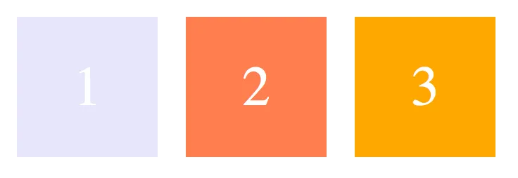
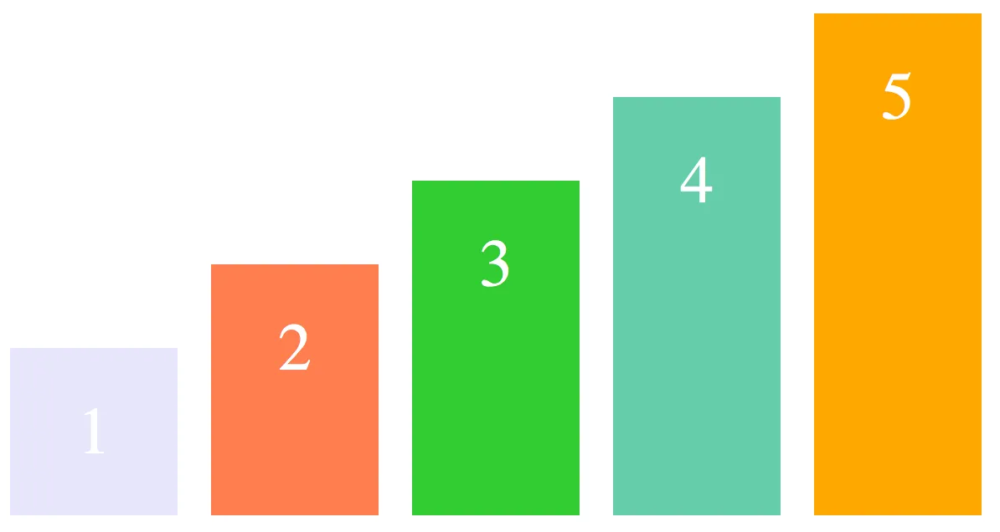
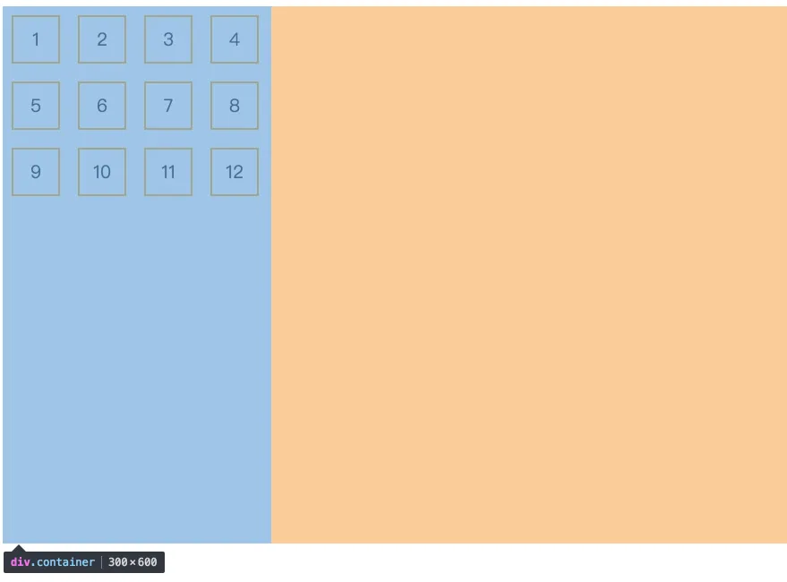

## `Flex`基本概念


在 `flex` 容器中默认存在两条轴，水平主轴(`main axis`) 和垂直的交叉轴(`cross axis`)。水平方向是默认的主轴，当然也可以通过修改使垂直方向变为主轴，水平方向变为交叉轴。<br/>
在容器中的每个单元块被称之为 `flex item`，每个项目占据的主轴空间为 (`main size`), 占据的交叉轴的空间为 (`cross size`)。

## `Flex`容器

首先，实现 `flex` 布局需要先指定一个容器，任何一个容器都可以被指定为 `flex` 布局，这样容器内部的元素就可以使用 `flex`来进行布局。

```css
.container {
  display: flex | inline-flex; //可以有两种取值
}
```

上面的代码分别生成一个块状或行内的 `flex` 容器盒子。简单说来，如果你使用块元素如 `div`，你就可以使用 `flex`，而如果你使用行内元素如`span`，你可以使用 `inline-flex`。<br/>
需要注意的是：当时设置 `flex` 布局之后，子元素的 `float`、`clear`、`vertical-align` 的属性将会失效。
只有下面六种属性可以设置在容器上，它们分别是：

### flex-direction

决定主轴的方向(即项目的排列方向)

```html
<style>
  .container {
    flex-direction: row | row-reverse | column | column-reverse;
  }
</style>
<body>
  <div class="container">
    <div>1</div>
    <div>2</div>
    <div>3</div>
  </div>
</body>
```

`row`：默认值，主轴为水平方向，起点在左端。



`row-reverse`：主轴为水平方向，起点在右端


`column`：主轴为垂直方向，起点在上


`column-reverse`：主轴为垂直方向，起点在下


### flex-wrap

决定容器内项目是否可换行

```html
<style>
  .container {
    flex-wrap: nowrap | wrap | wrap-reverse;
  }
</style>
<body>
  <div class="container">
    <div>1</div>
    <div>2</div>
    <div>3</div>
    <div>4</div>
    <div>5</div>
  </div>
</body>
```

`nowrap`：默认值，表示不换行，即当主轴尺寸固定时，空间不足时，项目尺寸会随之调整,所有的项目会在同一行并不会挤到下一行


`wrap`：换行，项目主轴总尺寸超出容器时会换行，第一行在上方


`wrap-reverse`：换行，第一行在下方


`column-reverse`：主轴为垂直方向，起点在下


::: tip `flex-direction` 和 `flex-wrap` 的简写属性：`flex-flow`

```css
.container {
  flex-flow: <flex-direction> || <flex-wrap>;
}
```

默认值为: `row` `nowrap`，感觉没什么卵用，老老实实分开写就好了。~~这样就不用记住这个属性了~~。

:::

### justify-content

决定主轴的方向(即项目的排列方向)

```html
<style>
  .container {
    justify-content: flex-start | flex-end | center | space-between | space-around;
  }
</style>
<body>
  <div class="container">
    <div>1</div>
    <div>2</div>
    <div>3</div>
    <div>4</div>
    <div>5</div>
  </div>
</body>
```

`flex-start`：默认值，左对齐。


`flex-end`：右对齐。


`center`：居中


`space-between`：两端对齐，项目之间的间隔相等，即剩余空间等分成间隙


`space-around`：每个项目两侧的间隔相等，所以项目之间的间隔比项目与边缘的间隔大一倍


### align-items

定义了项目在交叉轴上的对齐方式

```html
<style>
  .container {
    flex-direction: row;
    align-items: flex-start | flex-end | center | baseline | stretch;
  }
</style>
<body>
  <div class="container">
    <div>1</div>
    <div>2</div>
    <div>3</div>
    <div>4</div>
    <div>5</div>
  </div>
</body>
```

> 注意：以下测试是在水平方向为主轴的前提下测试的，即 flex-direction: row

`stretch`：默认值，即如果项目未设置高度或者设为 auto，将占满整个容器的高度。


假设容器高度设置为 `100px`，在所有项目都没有设置高度的情况下，项目的高度也为 `100px`。

`flex-start`：交叉轴的起点对齐。

假设容器高度设置为 100px，而项目分别为 20px, 40px, 60px, 80px, 100px, 则如下图显示。


`flex-end`：交叉轴的终点对齐



`center`：交叉轴的中点对齐


`baseline`：项目的第一行文字的基线对齐,以文字的底部为主，仔细看图可以理解


### align-content

定义了多根轴线的对齐方式，如果项目只有一根轴线，那么该属性将不起作用

```html
<style>
  .container {
    flex-direction: row;
    flex-wrap: wrap;
    align-content: flex-start | flex-end | center | space-between | space-around | stretch;
  }
</style>
<body>
  <div class="container">
    <div>1</div>
    <div>2</div>
    <div>3</div>
    <div>4</div>
    <div>5</div>
    <div>....</div>
    <div>12</div>
  </div>
</body>
```

这个属性我们可以这样理解：
当 `flex-wrap` 设置为 `nowrap` 的时候，容器仅存在一根轴线，因为项目不会换行，就不会产生多条轴线。
当 `flex-wrap` 设置为 `wrap` 的时候，容器可能会出现多条轴线，这时候就需要去设置多条轴线之间的对齐方式了。

> 注意：以下测试是在水平方向为主轴、并且不换行的前提下测试的，即 flex-direction: row; flex-wrap: nowrap

`stretch`：默认值，看下图。


从图可以看出又三条轴线(因为容器宽度有限)，当值为 `stretch` 时三条轴线会平分容器的垂直方向上的空间。
值得注意的是，虽然在每条轴线上项目的默认值也为 `stretch`，但是由于我每个项目我都设置了高度，所以它并没有撑开整个容器。

如果项目不设置高度的话就会变成下面这样：


可以看到，项目会自动分配高度，所以项目会占满整个容器。

`flex-start`：轴线全部在交叉轴上的起点对齐



`flex-end`：轴线全部在交叉轴上的终点对齐


`center`：轴线全部在交叉轴上的中间对齐


`space-between`：轴线两端对齐，之间的间隔相等，即剩余空间等分成间隙


`space-around`：每个轴线两侧的间隔相等，所以轴线之间的间隔比轴线与边缘的间隔大一倍


到这里关于容器上的所有属性都讲完了，接下来是`Flex`的项目属性，即在 `flex item` 上设置的属性。

## `Flex`项目属性

### order

定义项目在容器中的排列顺序，数值越小，排列越靠前，默认值为 `0`

```html
<style>
  .container {
    flex-direction: row;
    flex-wrap: wrap;
    align-content: flex-start | flex-end | center | space-between | space-around | stretch;
  }
</style>
<body>
  <div class="container">
    <div>1</div>
    <div>3</div>
    <div>5</div>
    <div style="order: -2">-2</div>
    <div style="order: -1">-1</div>
  </div>
</body>
```


可以看到，在 `HTML` 结构中，虽然 `-2`，`-1` 的 `item` 排在后面，但是由于它们分别设置了 `order`为`-2`和和 `-1`，他们就能够排到最前面。

### flex-basis

定义了在分配多余空间之前，项目占据的主轴空间，浏览器根据这个属性，计算主轴是否有多余空间

```css
.item {
  flex-basis: <length> | auto;
}
```

默认值：`auto`，即项目本来的大小, 这时候 `item` 的宽高取决于 `width` 或 `height` 的值

当主轴为水平方向时，项目设置了 `flex-basis`后，项目的宽度设置值会失效，`flex-basis` 需要跟 `flex-grow` 和 `flex-shrink` 配合使用才能发挥效果。

- 当 `flex-basis` 值为 `0` 时，是把该项目视为零尺寸的，表现上，该`item`会被折叠到最小值
- 当 `flex-basis` 值为 `auto` 时，则跟根据尺寸的设定值(假如为 `100px`)，则这 `100px` 不会纳入剩余空间。

### flex-grow

当有剩余空间时，定义项目的放大比例

```css
.item {
  flex-grow: <number>;
}
```

默认值为 `0`，即如果存在剩余空间，也不放大


当所有的项目都以 `flex-basis` 的值进行排列后，仍有剩余空间，那么这时候 `flex-grow` 就会发挥作用了。
如果所有项目的 `flex-grow` 属性都为 `1`，则它们将等分剩余空间。(如果有的话)
如果一个项目的 `flex-grow` 属性为 `2`，其他项目都为 `1`，则前者占据的剩余空间将比其他项多一倍。

如果当所有项目以 `flex-basis` 的值排列完后发现空间不够用了，且 `flex-wrap：nowrap` 时，此时 `flex-grow`则不起作用了（因为容器本身已经没有剩余空间了），这时候就需要接下来的这个属性。

### flex-shrink

当空间不足时，定义了项目的缩小比例

```css
.item {
  flex-shrink: <number>;
}
```

默认值: `1`，即如果空间不足，该项目将缩小，负值对该属性无效。


如果容器宽度为`200px`，即使我们手动给每个项目设置了宽度`50px`,但因为有`6`个元素,总宽度为`50*6=300px`，已经超过了容器宽度，这时候

- 如果每个容器都设置了`flex-shrink:1`，每个项目都会等比例缩小
- 如果一个项目的 `flex-shrink` 值 `0`，其他项目都为 `1`，则空间不足时，前者不缩小。

### flex: 1 代表什么

看一些组件库的源代码时，经常会遇到`flex:1`这个属性，那么这个属性到底是啥意思？

[`flex`](https://developer.mozilla.org/zh-CN/docs/Web/CSS/flex) 是一个 `CSS` 简写属性，用于设置 `Flex` 项目如何增大或缩小以适应其 `Flex` 容器中可用的空间

::: tip `flex` 是 `flex-grow` `flex-shrink` `flex-basis` 属性的简写

- [flex-grow](https://developer.mozilla.org/zh-CN/docs/Web/CSS/flex-grow) 用于**设置 `flex` 项目的增长系数**
  - 负值无效
  - 初始值为 `0`
  - 省略时默认值为 `1`
- [flex-shrink](https://developer.mozilla.org/zh-CN/docs/Web/CSS/flex-shrink) 用于**设置 `flex` 项目的收缩系数**（仅在默认 `width/height` 之和大于容器时生效）
  - 负值无效
  - 初始值为 `1`
  - 省略时默认值为 `1`
- [flex-basis](https://developer.mozilla.org/zh-CN/docs/Web/CSS/flex-basis) 用于**设置 `flex` 项目在主轴方向上的初始大小**
  - 初始值为 `auto`
  - 省略时默认值为 `0`

**`flex` 缩写语法规则**

**单值语法规则**

```css{17,18}
/* 全局属性值 */
/* 初始值 */
flex: initial; => flex: 0 1 auto
/* 从其父级继承 (flex 属性不可被继承，将设置为初始值) */
flex: inherit; => flex: 0 1 auto
/* 是关键字 initial 和 inherit 的组合(当属性可继承时为 inherit 不可继承时为 initial) */
flex: unset; => flex: 0 1 auto


/* 关键字值 */
/* 容器的宽度与高度来确定尺寸，容器有剩余空间就项目就均匀放大，容器无剩余空间就均匀缩小 弹性 */
flex: auto; => flex: 1 1 auto
/* 根据自身宽高来设置尺寸 非弹性 */
flex: none; => flex: 0 0 auto


/* 无单位数: flex-grow（标题答案）*/
flex: 1; => 1 1 0
flex: 0; => 0 1 0


/* 一个有效的 width/height 值: flex-basis */
flex: 10px; => 1 1 10px
flex: 20em; => 1 1 20em
flex: min-content; => 1 1 min-content
```

**双值语法规则**

1. **第一个值必须为一个无单位数**
2. 第二个值必须为以下之一
   1. **无单位数**：当作 `flex-shrink` 值
   2. **有效的 `width/height` 值**：当作 `flex-basis` 值

```css
/* 无单位数: flex-grow | flex-shrink */
flex: 2 2; => 2 2 0

/* 有效的 width/height 值: flex-grow | flex-basis */
flex: 2 30px; => 2 1 30px
```

**三值语法规则**

1. **第一个值必须为一个无单位数**，当作 `flex-grow` 值
2. **第二个值必须为一个无单位数**，当作 `flex-shrink` 值
3. **第三个值必须为一个有效的 `width/height` 值**，当作 `flex-basis` 值

```css
flex: 2 2 10%;
```

:::

## 相关链接

[我的博客](https://docs.fe-qianxun.com/)<br/>
[阮一峰：Flex 布局教程](https://www.ruanyifeng.com/blog/2015/07/flex-grammar.html)<br/>
[Basic concepts of flexbox](https://developer.mozilla.org/en-US/docs/Web/CSS/CSS_flexible_box_layout/Basic_concepts_of_flexbox)<br/>
[CSS Flexbox Layout Guide](https://css-tricks.com/snippets/css/a-guide-to-flexbox/)
