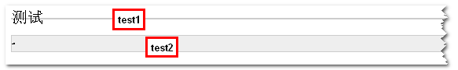

# line-height 属性详解

### 引言

最近看了一些关于`css`属性`line-height`的文章，才发现自己对于这个属性的理解过于浅薄了。于是就想把看过的几篇好文章总结下，再加上自己对于这个属性的理解，就有了这篇文章

首先用一句话简单概括下：所谓的`line-height`行高，其实就是**文本行基线间的垂直距离**

## 相关的几个概念

要想真正的理解`line-height`，我们还必须先了解相关的几个概念

### 顶线、中线、基线、底线

首先得了解下几个线的概念，看如下代码：

```html
<!DOCTYPE html>
<html>
  <head>
    <title>Test</title>
    <style type="text/css">
      span {
        background-color: #999;
        font-size: 3em;
      }
    </style>
  </head>
  <body>
    <div class="test">
      <div>
        <span>中文English</span>
        <br />
        <br />
        <span>English中文</span>
      </div>
    </div>
  </body>
  <html></html>
</html>
```

代码很简单，就是两个文本分两行显示，如下图，为了帮助我们的理解，对这个图片做一些辅助线：


很像初学英语时的字母四线三格写法，从上到下四条线分别是顶线、中线、基线、底线，

- **顶线**：中文汉字的顶部位置线
- **中线**：小写字母 x 的中部位置线
- **基线**: 小写字母 x 的下边缘线
- **底线**：中文汉字的底部位置线

::: tip

[vertical-align](https://developer.mozilla.org/zh-CN/docs/Web/CSS/vertical-align) 的四个属性值：`top`、`middle`、`baseline`、`bottom`，就是和这四条线相关

:::

### 行高、行距与半行距

在这四条线的基础上，我们继续对有关概念进行扩展：

- **行高**：是指上下文本行的基线间的垂直距离，即下图中两条红线间垂直距离，也就是区域 `1`，`2`，`3`，`4` 的距离之和

- **行距**：指一行底线到下一行顶线的垂直距离，即第一行粉线和第二行绿线间的垂直距离，也就是区域 `3` 的距离

- **半行距**：行距的一半，即区域 `3` 垂直距离 `/2`


### 内容区、行内框、行框

为了更深刻的理解`line-height`，此处我们还需了解下内联盒模型的概念，它主要包含以下概念：

- **内容区**：底线和顶线包裹的区域，即下图深灰色背景区域，它的高度会受到 `font-family(字体)`和 `font-size(字号)`的影响

- **行内框**：每个行内元素会生成一个行内框，行内框是一个浏览器渲染模型中的一个概念，无法显示出来，在没有其他因素影响的时候`（padding 等）`，行内框等于内容区域。改变行高时行内框高度不变，半行距`（行高-字体 size）/ 2`分别增加/减少到内容区域的上下两边（下图中的深蓝色区域）。

- **行框`（line box）`**：行框是指本行的一个虚拟的矩形框，是浏览器渲染模式中的一个概念，并没有实际显示。行框高度等于本行内所有元素中行内框最大的值（以行高值最大的行内框为基准，其他行内框采用自己的对齐方式向基准对齐，最终计算行框的高度），当有多行内容时，每行都会有自己的行框。


这几个概念通过上图还是不太好理解，可以参考下面的代码和图：

```html
<div style="background-color:#ccc;">
  <span style="font-size:1em;background-color:#666;">中文English</span>
  <span style="font-size:3em;background-color:#999;">中文English</span>
  <span style="font-size:3em;background-color:#999;">English中文</span>
  <span style="font-size:1em;background-color:#666;">English中文</span>
</div>
```


一个行框包含着一整行的内容，各个行框之间**上下紧密贴合**排列，就形成了最终呈现在页面上行与行之间的位置关系

通过理解上述相关的概念，我们对`line-height`行高属性有了更为深刻的了解，在这里总结下：`line-height` 属性设置行间的距离（行高），不能使用负值，它可以认为是相邻文本行基线间的距离。当我们设置行高时，行内框高度不变，`line-height` 与 `font-size` 的计算值之差(行距，可能为负)分为两半，分别加或减到该行内框的顶部和底部

## 几个相关问题

### 在没有设置高度，只有文字的情况下，元素的高度从何而来？是由字体撑开的吗？

恐怕很多人第一反应都是：如果没有人为的设置元素高度，元素默认的高度都是由字体撑开的。

其实这并不是完全正确的，看下面这个例子：

```html
<!DOCTYPE html>
<html>
  <head>
    <title>Test</title>
    <style type="text/css">
      .test1 {
        font-size: 20px;
        line-height: 0;
        border: 1px solid #cccccc;
        background: #eeeeee;
      }
      .test2 {
        font-size: 0;
        line-height: 20px;
        border: 1px solid #cccccc;
        background: #eeeeee;
      }
    </style>
  </head>
  <body>
    <div class="test1">
      <span>测试</span>
    </div>
    <br />
    <div class="test2">
      <span>测试</span>
    </div>
  </body>
  <html></html>
</html>
```

结果如下图：



`test1` 与 `test2` 本身都没有设置高度，他们的区别只在与`font-size`和`line-height`。`test1` 的 `font-size` 为 `20px`， `line-height` 为 `0`， `test2`的 `font-size` 为 `0`，`line-height` 为 `20px`

他们呈现出的效果完全不同：`test1` 的高度为 `2px`，实际上是其上下 `border` 的高度，`test2` 的高度为 `22px`，使其`line-height` + `上下border`的高度

由此我们就可以得出结论：**在没有设置高度，只有文字的情况下，元素的高度从与`line-height`有关（具体高度由其行框高度决定）**。

### 行高的垂直居中性

行高还有一个特性，叫做垂直居中性。`line-height`的最终表现是通过行框实现的，而无论行框所占据的高度是多少（无论比内容区高还是比内容区低），其占据的空间都是与文字内容公用水平中垂线的

参考以下代码：

```html
<!DOCTYPE html>
<html>
  <head>
    <title>Test</title>
    <style type="text/css">
      .test1 {
        font-size: 20px;
        line-height: 0;
        border: 1px solid #cccccc;
        color: #43b883;
      }
      .test2 {
        font-size: 20px;
        line-height: 60px;
        border: 1px solid #cccccc;
        color: #4f8ef7;
      }
    </style>
  </head>
  <body>
    <div class="test1">
      <span>测试1</span>
    </div>
    <br />
    <div class="test2">
      <span>测试2</span>
    </div>
  </body>
  <html></html>
</html>
```

结果如下图：


可以看到：无论行高是 `0` 还是 `60px`，文字内容中心始终位于行高的水平中垂线上，这个特性是我们实现文字或图片的垂直居中对齐的基础

## 关于`line-height`的应用

### 单行文本的垂直居中

想必大家都知道一种说法：想要让一个单行文本垂直居中，那么只要设置 `line-height` 的大小和 `height` 高度一样就可以了

参考以下代码：

```html
<!DOCTYPE html>
<html>
  <head>
    <title>Test</title>
    <style type="text/css">
      #cont {
        width: 600px;
        height: 100px;
        background-color: #43b883;
        font-size: 30px;
        line-height: 100px;
      }
    </style>
  </head>
  <body>
    <div id="cont">hello world!</div>
  </body>
</html>
```


文本确实居中了，但是看了[张鑫旭大佬的文章](https://www.zhangxinxu.com/wordpress/2009/11/css%E8%A1%8C%E9%AB%98line-height%E7%9A%84%E4%B8%80%E4%BA%9B%E6%B7%B1%E5%85%A5%E7%90%86%E8%A7%A3%E5%8F%8A%E5%BA%94%E7%94%A8/)，我又自己试验过后发现：`line-height` 的值设置为和 `height`值一样来实现单行文本的垂直居中这种说法并不是很正确

参考以下代码：

```html
<!DOCTYPE html>
<html>
  <head>
    <title>Test</title>
    <style type="text/css">
      #cont {
        width: 600px;
        background-color: #43b883;
        font-size: 30px;
        line-height: 100px;
      }
    </style>
  </head>
  <body>
    <div id="cont">hello world!</div>
  </body>
</html>
```


这段代码和之前代码区别只有一点：这段代码没有设置`height`，但是也实现了垂直居中的效果。这证明：要让单行文本垂直居中。其实只需要设置 `line-height` 这一个属性就可以了，根本不需要再设置一个 `height` 属性

### 多行文本的垂直居中

使用 `line-height` 来控制文本垂直居中，不仅仅用于单行文本， 就连多行文本其实也是可以进行垂直居中的

参考以下代码：

```html
<!DOCTYPE html>
<html>
  <head>
    <title>Test</title>
    <style type="text/css">
      #cont {
        width: 600px;
        background-color: #43b883;
        line-height: 200px;
      }
      #cont > p {
        line-height: normal;
        display: inline-block;
        vertical-align: middle;
      }
    </style>
  </head>
  <body>
    <div id="cont">
      <p>
        测试数据...测试数据...测试数据...测试数据...测试数据...测试数据...测试数据...
        测试数据...测试数据...测试数据...测试数据...测试数据...测试数据...测试数据...
        测试数据...测试数据...测试数据...测试数据...测试数据...测试数据...测试数据...
        测试数据...测试数据...测试数据...测试数据...测试数据...测试数据...测试数据...
      </p>
    </div>
  </body>
</html>
```

效果如下图：


内部的实现原理如下：

1. 给`p`设置`display: inline-block`让这个元素保持内联元素的特性
2. 给`p`设置`line-height: normal`，清除继承下来的行高
3. 给`p`设置`display: inline-block`后，会产生行框盒子，这个行框盒子会附带一个[幽灵空白节点](https://juejin.cn/post/7037131631252996126)父元素设置的`line-height: 200px`会作用到这个幽灵空白节点上，从而在多行文本前撑开了`200px`的高度
4. 又因为`p`现在是内联元素，内联元素默认基线对齐，给`p`设置了`vertical-align:middle`属性值来调整这个多行文本的垂直位置，最后就实现了我们所看到的多行文本垂直居中效果

## `line-height`的取值与继承

`line-height`的取值还比较容易理解：

| 值        | 说明                                                         |
| --------- | ------------------------------------------------------------ |
| `normal`  | 默认，设置合理的行间距。                                     |
| `number`  | 设置数字，此数字会与当前的字体尺寸相乘来设置行间距（倍数）。 |
| `length`  | 设置固定的行间距。                                           |
| `%`       | 基于当前字体尺寸的百分比行间距。                             |
| `inherit` | 规定应该从父元素继承 `line-height`                           |

`line-height`的继承就有些玄学了，具体为：

- 父元素的 `linHeight` 值为具体数值时，子元素的 `lineHeight` 值就为父元素的 `lineHeight` 值。如果父元素的值为 `20px`，子元素的值也会是 `20px`
- 父元素的 `lineHeight` 值为比例时，子元素会继承该比例并根据自己的 `fontSize` 值计算自己的 `lineHeight` 值。如果父元素的 `lineHeight` 值为 `1.5`，子元素的 `fontSize` 值为 `16px` 时，子元素的 `lineHeight` 值就为 `16px \* 2 = 32px`
- 父元素的 `lineHeight` 值为百分比时，子元素会继承父元素根据 `fontSize` 与该比例计算出来的值。如果父元素的 `lineHeight` 值为 `200%`，父元素的 `fontSize` 值为 `20px` 时，子元素的 `lineHeight` 值就为 `20px \* 200% = 40px`

## 参考链接

[张鑫旭——css 行高 line-height 的一些深入理解及应用](https://www.zhangxinxu.com/wordpress/2009/11/css%E8%A1%8C%E9%AB%98line-height%E7%9A%84%E4%B8%80%E4%BA%9B%E6%B7%B1%E5%85%A5%E7%90%86%E8%A7%A3%E5%8F%8A%E5%BA%94%E7%94%A8/)<br>
[ HTML 中一行文字是如何排布的？什么是内容区、行内框、行框？](https://github.com/JuniorTour/blog/issues/3)<br>
[CSS line-height 属性总结](https://zhuanlan.zhihu.com/p/352965852)<br/>
[CSS 行高——line-height](https://www.cnblogs.com/dolphinX/p/3236686.html)
