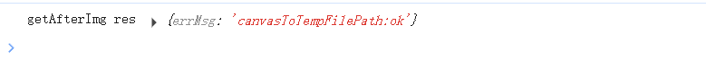
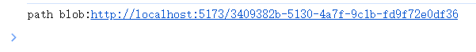

# 企业微信加水印的探索与踩坑

## 引言

最近接了一个需求是这样的：用户在企业微信中上传图片时，在图片上加上时间、地点等水印，然后上传到服务器。

本来以为是个挺简单的需求，但是实际做下来，发现还是有不少坑（吐槽下： `uniapp` 的坑够多了，再加上企业微信，简直是大坑巨坑），做这个需求前前后后花了不少时间精力，值得在这里总结下。

## 图片加水印

第一步我们要做到在上传图片时，在图片上有文字水印

这块的思路还不算特别困难，其中主要的添加水印的函数我定义为`drawStart`，它的具体实现逻辑是：

1. `getImgInfo`获取图片信息，`getScreenWidth`获取当前画布信息，根据图片宽高比例算出画布高度
2. [`uni.createCanvasContext`](https://uniapp.dcloud.net.cn/api/canvas/createCanvasContext.html) 创建`canvas`实例`ctx`
3. `ctx.drawImage`绘制图片到当前画布，参数分别是：图片路径、左上角 x 坐标、左上角 y 坐标、绘制的宽度、绘制的高度
4. `ctx.fillText`绘制文本到当前画布，参数分别是：文本内容、左上角 x 坐标、左上角 y 坐标
5. `crx.draw`将当前画布上的内容画到`canvas`中
6. `uni.canvasToTempFilePath`将当前画布内容导出生成图片，并返回这个临时图片文件路径
7. 拿到这个临时图片路径，上传给服务器

详细代码如下：

```vue
<template>
  <view class="tips">点击下方按钮添加图片，单击图片可放大进行预览</view>

  <view class="imgWrapper">
    <view class="imgItem" v-for="(item, index) in imgFilePathList" :key="item.hash">
      <image
        :src="item"
        style="width: 250rpx; height: 250rpx"
        :key="index"
        @click="previewImage(item, index)"
        mode="aspectFit"
      >
      </image>
    </view>
    <view class="add">
      <uv-icon name="plus" size="26" bold @click="addClick"></uv-icon>
    </view>
  </view>

  <uv-toast ref="toast"></uv-toast>
  <canvas
    class="canvas-box"
    :style="{ width: canvasW + 'px', height: canvasH + 'px' }"
    canvas-id="myCanvas"
  >
  </canvas>
</template>

<script setup>
import { onLoad } from "@dcloudio/uni-app";
import { ref, watch, toRefs, inject, onMounted, getCurrentInstance } from "vue";
import dayjs from "dayjs";

onLoad(async () => {
  // await useWxRegister(["getLocation"], location.href.split("#")[0]);
});

const toast = ref(null);

const imgFilePathList = ref([]); // 图片临时路径接口
const time = ref(""); //绘制图片的时间
const canvasW = ref(0); //画布宽度
const canvasH = ref(0); //画布高度

// vue3 获取实例
const instance = getCurrentInstance();

const addClick = () => {
  uni.chooseImage({
    // sourceType: "camera", // 可选择相机或相册
    success: async function (res) {
      uni.showLoading({
        title: "加载中...",
        mask: true,
      });

      let imgPath = res.tempFilePaths;
      let tempFiles = res.tempFiles;

      // 选择图片时有可能多选，所以需要添加遍历去一个个添加水印
      for (let i = 0; i < imgPath.length; i++) {
        //循环添加水印
        let drawPath = await drawStart(imgPath[i]);
        console.log("drawPath", drawPath);

        imgFilePathList.value.push(drawPath.path);
      }

      // 使用 uni.uploadFile上传图片
      /* await Promise.all(
        imgFilePathList.value.map((filePath) => {
          console.log("filePath", filePath);
          return uni.uploadFile({
            url: `https://example.com/upload`, // 替换为你的上传接口地址
            header: {
              token: accessToken,
              Authorization: `Bearer ${accessToken}`,
            },
            name: "multFiles",
            file: filePath,
            formData: {},
          });
        }),
      ); */

      uni.hideLoading();

      toast.value.show({
        type: "success",
        message: "上传成功",
        complete: () => {},
      });
    },
  });
};

const drawStart = (imgSrc) => {
  return new Promise(async (resolve, reject) => {
    //获取图片信息
    const infoRes = await getImgInfo(imgSrc);
    console.log("infoRes", infoRes);

    //获取图片宽度
    const imgWidth = infoRes.width;
    //获取当前屏幕宽度赋值给画布宽度
    if (!canvasW.value) {
      canvasW.value = await getScreenWidth();
    }
    //获取画布宽度跟图片宽度的比例
    const perc = canvasW.value / imgWidth;
    //根据图片宽高比例算出画布高度
    canvasH.value = infoRes.height * perc;
    //延时等待画布宽高渲染完成再绘制
    setTimeout(async () => {
      console.log("instance", instance);
      const ctx = uni.createCanvasContext("myCanvas", instance);
      console.log("ctx", ctx);

      // 绘制背景图片  参数分别是：图片路径、左上角x坐标、左上角y坐标、绘制的宽度、绘制的高度
      ctx.drawImage(imgSrc, 0, 0, canvasW.value, canvasH.value);

      // 保存当前的画布状态
      ctx.save();
      // 恢复到最近一次保存的画布状态
      // ctx.restore();
      // 绘制文本
      ctx.setFontSize(18);
      ctx.setFillStyle("#F42932");

      let time = getTimeStr(); //拿到时间
      let lineHeight = 22;
      let y = 40;
      ctx.fillText(time, 10, y);
      ctx.draw();

      //延时等待渲染完成再导出图片
      setTimeout(async () => {
        //获取水印临时图片
        const tempFilePath = await getAfterImg(instance);
        console.log("tempFilePath", tempFilePath);
        // #ifdef APP-PLUS
        resolve(tempFilePath);
        //#endif
        // #ifdef H5
        //base64转bold
        const url = tempFilePath.replace(/[\r\n]/g, "");
        console.log("url", url);
        //调用
        let file = base64ToFile(url, "test.png");

        const tempPath = URL.createObjectURL(file);
        file.path = tempPath;

        resolve(file);

        // #endif
      }, 600);
    }, 100);
  });
};

const getAfterImg = (instance) => {
  //获取水印临时图片
  return new Promise((resolve, reject) => {
    uni.canvasToTempFilePath(
      {
        canvasId: "myCanvas",

        success: (res) => {
          console.log("getAfterImg res", res);
          resolve(res.tempFilePath);
        },
        fail: (err) => {
          console.log("getAfterImg err", err);
          uni.hideLoading();
          console.log("获取水印临时图片错误" + JSON.stringify(err));
          reject(err);
        },
      },
      instance
    );
  });
};

const getImgInfo = (imgSrc) => {
  //获取图片宽高
  return new Promise((resolve, reject) => {
    uni.getImageInfo({
      src: imgSrc,
      success: (infoRes) => {
        resolve(infoRes);
      },
      fail: (err) => {
        uni.hideLoading();
        console.log("获取图片宽高错误" + JSON.stringify(err));
        reject(err);
      },
    });
  });
};

const getScreenWidth = () => {
  //获取当前屏幕宽度
  return new Promise((resolve, reject) => {
    uni.getSystemInfo({
      success: (res) => {
        resolve(res.windowWidth);
      },
      fail: (err) => {
        uni.hideLoading();
        console.log("获取当前屏幕宽度错误" + JSON.stringify(err));
        reject(err);
      },
    });
  });
};

const previewImage = (item, index) => {
  uni.previewImage({
    urls: imgFilePathList.value,
    current: index,
  });
};

const base64ToFile = (base64Data, filename = "file") => {
  // 分割Base64头和数据部分
  const arr = base64Data.split(",");
  const mime = arr[0].match(/:(.*?);/)[1];
  const bstr = atob(arr[1]);

  // 转换为字节数组
  let n = bstr.length;
  const u8arr = new Uint8Array(n);
  while (n--) {
    u8arr[n] = bstr.charCodeAt(n);
  }

  // 生成File对象
  return new File([u8arr], filename, {
    type: mime,
    lastModified: Date.now(),
  });
};

const getTimeStr = () => {
  let currentTime = dayjs().format("YYYY-MM-DD HH:mm:ss");
  return `当前时间：${currentTime}`;
};
</script>

<style lang="scss" scoped>
.tips {
  padding-top: 100px;
  padding-left: 20px;
  padding-bottom: 10px;
}
.imgWrapper {
  display: flex;
  padding-left: 20px;
  padding-right: 20px;
  gap: 10px;
  flex-wrap: wrap;
  align-items: center;
}
.imgItem {
  position: relative;
  :deep(.uv-icon__icon) {
    color: #f56c6c !important;
  }
}
.icon {
  position: absolute;
  right: -8px;
  top: -8px;
}

.add {
  display: flex;
  align-items: center;
  justify-content: center;
  width: 110px;
  height: 85px;
  border: 5px solid #dadbde;
  :deep(.uv-icon__icon) {
    color: #dadbde !important;
  }
}

:deep(.tki-tree-view) {
  padding-top: 0px;
  margin-top: -5px;
}
:deep(.uv-image) {
  width: calc(100% - 10px);
  height: 90px !important;
}

.canvas-box {
  //隐藏canvas盒子
  position: absolute;
  top: -3000px;
}
</style>
```

添加水印的基本逻辑已经完成，但在实现它的过程中，还是踩了不少坑

### 坑 1： `uni.canvasToTempFilePath` 接口调用成功，但是没有正确的返回值

在实现添加水印的基本逻辑中，我们需要使用`uni.canvasToTempFilePath`将当前画布内容导出生成图片，并返回这个图片文件路径。

可是我在使用过程中，并没有成功的获取到图片临时路径。奇怪的是，回调函数却走了`success`函数，我又试着打印`success`的返回内容，打印出的结果是
`errMsg: "canvasToTempFilePath:ok"`

```js
uni.canvasToTempFilePath(
  {
    canvasId: "myCanvas2",
    success: (res) => {
      console.log("getAfterImg res", res);
      resolve(res.tempFilePath);
    },
    fail: (err) => {
      console.log("getAfterImg err", err);
      uni.hideLoading();
      console.log("获取水印临时图片错误" + JSON.stringify(err));
      reject(err);
    },
  },
  instance
);
```



看不懂了... `errMsg: "canvasToTempFilePath:ok"`是啥意思？现在既然走`success`回调函数了，那表示调用`uni.canvasToTempFilePath`应该已经成功了，但是它的返回值里面却有`errMsg`？后面还跟个`ok`？那到底是成功了还是失败了？

按理说，我没有获取到临时路径，肯定是哪里出问题了，应该会走失败的回调`fail`，这样我就可以根据`fail`里面的错误信息去定位问题，但是现在我没有成功获取临时路径，却走了`success`，`success`里面又返回了看不太明白的`errMsg: "canvasToTempFilePath:ok"`，真是奇怪

虽然不太理解错误信息，但是我看了半天代码还是硬找到了问题：原来是参数传错了...... 当时的项目中有好几个`canvas`实例，`uni.createCanvasContext`传递的参数`canvasId`为`myCanvas`，`uni.canvasToTempFilePath`函数传递的参数却不是它，因此导致了这个函数的报错

的确是我自己的问题，粗心大意参数都传错了，但是这个报错信息着实也太坑了，根本什么信息都判断不出来。`Google`了一下，很多人都在吐槽`uniapp`相关的接口返回的信息过于笼统，导致调试有一定的困难。这也几乎算是`uniapp`的通病了

也没啥办法，以后调用`uniapp`相关`API`的时候自己还是再仔细点吧，得先保证自己的代码不能出错，不然排查问题确实浪费时间精力

### 坑 2：`uni-uploadFile` 上传图片丢失后缀名

在前面的步骤中，我们通过`uni.canvasToTempFilePath`已经拿到了图片的临时路径，但是在`H5`平台下，这个[临时路径](https://en.uniapp.dcloud.io/api/canvas/canvasToTempFilePath.html)是`base64`编码，服务器那边是需要我们传递一个`blob`的临时路径的，为此我们需要一个工具函数，能够把`base64`编码的图片转换成`blob`，看了网上的一些文章，[iamge-tools](https://ext.dcloud.net.cn/plugin?id=123)中`base64ToPath`这个函数可以用下，使用的代码如下：

```js
const drawStart = () => {
  // ...省略
  // tempFilePath 是`uni.canvasToTempFilePath` 拿到的 base64编码
  const url = tempFilePath.replace(/[\r\n]/g, "");
  console.log("url", url);
  base64ToPath(url)
    .then((path) => {
      console.log("path", path);
      resolve(path);
    })
    .catch((error) => {
      uni.hideLoading();
      console.log("图片的临时路径转换出错了：", error);
    });
};
```

打印下看下



似乎没什么毛病，将这个`path`赋值给`image`的`src`，图片也能够正常显示。本以为将这个`path`通过`uni.uploadFile`传递给后端就大功告成了，没想到又出了岔子——图片竟然上传不上去！

后端老哥一顿排查，发现我上传的图片的`filename`为`file-1752399256`，后端拿到这个文件名后，无法判断判断这个图片的类型，从而无法进行后续处理

也就是说，我通过`uni.uploadFile`这个方法上传图片时，图片本身的文件名丢了，它自动补充了一个不带后后缀名的形如`file-xxx`的文件名

这什么鬼操作？

去`DCloud`社区看了一圈，不少人都出现了这种情况，参考[这个帖子](https://ask.dcloud.net.cn/question/92905)、[这个帖子](https://ask.dcloud.net.cn/article/40534)和[这个帖子](https://ask.dcloud.net.cn/question/65261)， 有人说是[使用`uni.uploadFile`时少传了`filePath`和`name`](https://blog.csdn.net/qq_39246667/article/details/123062522?spm=1001.2014.3001.5502)，可是我传了啊，同样没用.有的人[使用`axios`重写写了`blob`链接上传的逻辑](https://ask.dcloud.net.cn/question/168844)，可以解决，但是却不适用我的项目

我参考了一位老哥的思路，又做了一些自己的更改，终于成功了，我的逻辑如下

1. 先把`base64`图片转为文件，并给他一个文件名
2. 通过[`URL.createObjectURL`](https://developer.mozilla.org/en-US/docs/Web/API/URL/createObjectURL_static)生成一个临时地址
3. 把这个临时地址赋予这个文件的`path`字段

具体代码如下：

```js
const drawStart = () => {
  // ...省略
  // tempFilePath 是`uni.canvasToTempFilePath` 拿到的 base64编码
  const url = tempFilePath.replace(/[\r\n]/g, "");
  console.log("url", url);

  let file = base64ToFile(url, "test.png");
  const tempPath = URL.createObjectURL(file);
  file.path = tempPath;

  resolve(file.path);
};

const base64ToFile = (base64Data, filename = "file") => {
  // 分割Base64头和数据部分
  const arr = base64Data.split(",");
  const mime = arr[0].match(/:(.*?);/)[1];
  const bstr = atob(arr[1]);

  // 转换为字节数组
  let n = bstr.length;
  const u8arr = new Uint8Array(n);
  while (n--) {
    u8arr[n] = bstr.charCodeAt(n);
  }

  // 生成File对象
  return new File([u8arr], filename, {
    type: mime,
    lastModified: Date.now(),
  });
};
```

通过这样饶了一圈处理，上传的图片文件成功有了文件名，后端成功的接收到了这个图片文件，整个前后端逻辑也就能跑通了，也真够麻烦的

值得一说的是：[`uni.upload`上传图片，服务器端接受的文件名没有后缀](https://ask.dcloud.net.cn/question/65261)这个问题早在`2019`年就有人提出来了，官方却到现在都没有修复，一直有人陆陆续续的踩这个坑，又对`uniapp`的印象分低了几分...

## 获取地址，并将地址字符串作为水印加到图片上

现在我们已经成功的把时间字符串作为水印加到图片上，图片也已经能够通过接口上传到服务器上，剩下的只需要把地址字符串也作为水印加到图片上，这个需求就算完成了。整体的实现思路也比较容易能想到：

1. 调用企业微信`wx.getLocation`接口获取当前地址经纬度
2. 调用百度地图的逆地址解析接口，获取当前地址地址字符串

想到要调用企业微信的相关`API`，我就浑身一颤。当初最开始做企业微信自建应用的时候印象非常深刻，官方文档描述的不具体，参考资料又少之又少，导致踩了很多坑，走不少弯路。哎，果然，现在只是调用一下`getLocation`方法又掉进坑里了

### 坑 1：`wx.getLocation`方法定位不准

第一个坑是：当我调用`wx.getLocation`方法获取经纬度，经纬度根本不准，定位的是当前所在市政府经纬度，我查阅了不少资料，一开始以为是`type`问题

我将 `type` 中的`wgs84`改成了火星坐标`gcj02`

```js
wx.getLocation({
  type: "gcj02",
  success: function (res) {
    // ...
  },
});
```

没啥用，定位还是在市政府，看了[这篇文章](https://www.cnblogs.com/ZhYQ-Note/articles/17903140.html)后我才明白，原来调用`getLocation`方法必须使用`jWeixin`而不是`wx`

当我们导入企业微信的 sdk 时，会产生两个全局变量，一个是`wx`，一个是`jwxwork`，但是 `uniapp` 中也有个默认的 `wx` 变量，会覆盖掉企业微信的 `wx` 变量，当我们使用 `wx.getLocation()`方法时，其实调用的是 `uniapp` 的 `wx.getLocation()`方法，而为了使定位准确，我们必须使用 `jwxwork.getLocation()`方法

此外，参考[这篇文章](https://blog.csdn.net/Jekin_KE/article/details/89484127)，为了使得定位准确， `getLocation`这个`API`还必须使用线上真机测试，我当时调试的时候因为是个`h5`页面，我是直接在浏览器上调试的，所以定位根本，真坑啊

### 坑 2：企业微信 `JS-SDK` 安卓设备正常，但无法在 IOS 设备上使用

当我满心欢喜的发布上线时，在线上却出问题了—— `IOS` 设备直接报错`Uncaught ReferenceError: jWeixin is not defined`

`WTF`？啥情况啊，`jWeixin`不是在`html`页面通过 CDN 链接引入的嘛，咋还会不存在？

```js
 <script src="https://res.wx.qq.com/open/js/jweixin-1.2.0.js"></script>
 <script src="https://open.work.weixin.qq.com/wwopen/js/jwxwork-1.0.0.js"></script>
```

于是我在所有使用`jWeixin`的地方都打上了日志，发现`jWeixin`初始化的时候有，使用的时候却没有了，这是什么情况？难道是有变量把`jWeixin`覆盖了？在网上看了一圈，原因没找到，但是[这篇文章](https://juejin.cn/post/7202914988012797989)却给出了一个行之有效的解决方案

主要思路是把`jWeixin`缓存下来，放到一个自己定义的全局变量里面，在初始化和调用企业微信相关接口时使用我们自己定义的这个变量，方法简单，但却十分有效！

总算时把这个需求搞定了！

## 总结

只是一个图片加水印的效果，如果是在`web`端，可能一两个小时就搞定了，但是换做企业微信`H5` + `uniapp`，却花了我好几天时间，这俩玩意儿的坑简直不要太多。文中有些坑的解决方案，我可能写的三言两语就轻松带过了，但真实情况可能花了我不少时间精力。希望如果有同样踩到这些坑的朋友，看到这篇文章能够少走些弯路吧
