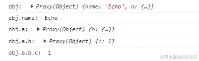

## 引言

`ref` 和 `reactive` 是 `Vue 3` 的 `Composition API` 中提供的两个**响应式数据声明方法**，它们都是 `Vue 3` 中实现响应式数据的关键手段。然而，它们在使用方式和适用场景上有所不同。

本文将会比较他们的使用方式、优缺点和适用场景，并对原理进行分析。

## ref

`ref` 是一个函数，它的作用是将一个普通的 `JavaScript` 变量（基本类型或者引用类型）包装成一个响应式的数据。
官方文档给出的解释是：**接受一个内部值，返回一个响应式的、可更改的 `ref` 对象，此对象只有一个指向其内部值的属性 `.value`**。

看下下面这个使用 `ref` 的例子：

```vue
<template>
  <div class="main">
    <p>price: {{ product.price }}</p>
    <button @click="changeProductPrice">修改product.price</button>

    <p>price: {{ count }}</p>
    <button @click="changeProductPrice">修改count</button>
  </div>
</template>

<script setup>
import { ref } from 'vue'
const product = ref({ price: 0 })
const count = ref(0)

const changeProductPrice = () => {
  product.value.price += 10
}
const changeCount = () => {
  count.value += 1
}
</script>
```

上面这段代码中，我们首先使用 `ref` 函数创建了一个名为 `count` 的响应式引用，初始值为基本数据类型。
然后使用 `ref` 函数创建了一个名为 `product` 的响应式引用，初始值为引用数据类型，是一个对象。
可以看到，更改这两个响应式引用的方法略有不同。

`ref` 函数的参数既可以传递原始数据类型也可以传递引用类型，但需要注意的是

- 如果传递的是原始数据类型的值，那么指向原始数据的那个值**保存在返回的响应式数据的 `.value` 中**，例如上面的 `count.value`；
- 如果传递的一个引用类型的值，例如传个对象，返回的响应式数据的 `.value` 中**对应有指向原始数据的属性**，例如上面的 `product.value.price`

我们不妨打印一下 `count` 和 `product` 这两个响应式数据，看看有什么不一样的地方：


上图中，我们可以看到：不管给 `ref` 函数传递原始数据类型的值还是引用数据类型的值，返回的都是由 `RefImpl` 类构造出来的对象，但不同的是对象里面的 `value`：

- 如果 `ref` 函数参数传递的是原始数据类型的值，那么 `value` 是一个**原始值**
- 如果 `ref` 函数参数传递的是引用数据类型的值，那么 `value` 是一个 **`Proxy` 对象**

### ref 的解包

**在模板中解包**

::: tip
解包指的是 `ref` 在模板上下文即 `template` 中会被自动解析出来，使用时不需要加`.value`
:::

解包的规则是：**只有最顶级的 `ref` 属性才会被解包**。

是否是最顶级主要是判断 `ref` 是**直接定义的变量还是作为对象的属性**。比如在下面的例子中，`count` 是最顶级变量，但是 `person.age` 不是。
所以`count` 会被自动解包，而 `person.age` 不会自动解包。

```vue
<template>
  <div class="main">
    <p>count: {{ count + 1 }}</p>
    <p>age: {{ person.age + 1 }}</p>
  </div>
</template>

<script setup>
import { ref } from 'vue'

const count = ref(0)
const person = {
  age: ref(26),
}
</script>
```

对于`count`，页面直接渲染出来结果 `2` ，但是对于 `person.age` ，页面渲染的结果却是：`[object Object]1`。这是因为在计算表达式时 `person.age` 没有被解包，仍然是一个 `ref` 对象。

为了解决这个问题，我们可以将 `age` **解构**成为一个顶级属性：

```vue
<template>
  <div class="main">
    age input：
    <input type="text" v-model="age" />
    <p>age: {{ age }}</p>
  </div>
</template>

<script setup>
import { ref } from 'vue'

const person = {
  age: ref(26),
}
const { age } = person
</script>
```

可以看到： `age` 经过结构之后，就可以成功解包并保持其响应性。

**在 reactive 中的解构**

`ref` 作为 `reactive` 的属性被访问或者修改时会被自动解包。

这个很好理解，我们直接看下面的代码就行：

```vue
<template>
  <div class="main">
    <p>count: {{ state.count }}</p>
  </div>
</template>

<script setup>
import { ref, reactive } from 'vue'

const count = ref(0)
const state = reactive({
  count,
})

console.log(state.count === count.value) // true

console.log(state.count) // 0

state.count = 1
console.log(count.value) // 1
</script>
```

### 优点

1. **统一性**

`ref` 的核心优势之一是它的统一性。它提供了一种简单、一致的方式来处理所有类型的数据，无论是数字、字符串、对象还是数组。这种统一性极大地简化了开发者的代码，减少了在不同数据类型之间切换时的复杂性。

```js
import { ref } from 'vue'

const num = ref(0)
const str = ref('Hello')
const obj = ref({ count: 0 })

// 修改基本数据类型
num.value++
str.value += ' World'

// 修改对象
obj.value.count++
```

2. **深层响应性**

`ref` 支持深层响应性，这意味着它可以追踪和更新嵌套对象和数组中的变化。这种特性使得 `ref` 非常适合处理复杂的数据结构，如对象和数组。

```js
import { ref } from 'vue'

const obj = ref({
  user: {
    name: 'xiaoming',
    details: {
      age: 18,
    },
  },
})

// 修改嵌套对象，模版中的 age 会自动更新
obj.value.user.details.age++
```

当然，为了减少大型不可变数据的响应式开销，也可以通过使用 [shallowRef](https://cn.vuejs.org/api/reactivity-advanced#shallowref) 来放弃深层响应性。

```js
import { shallowRef } from 'vue'

const obj = shallowRef({
  user: {
    name: 'xiaoming',
    details: {
      age: 18,
    },
  },
})

obj.value.user.details.age++
// 修改嵌套对象，模版中的 age 不会自动更新

obj.value = {
  user: {
    name: 'xiaoming',
    details: {
      age: 20,
    },
  },
}
// 只有整个替换掉.value 对象时，才会触发模板更新
```

3. **灵活性**

`ref` 提供了高度的灵活性，尤其在处理普通赋值和解构赋值方面。这种灵活性使得 `ref` 在开发中的使用更加方便，特别是在进行复杂的数据操作时。

```js
import { ref } from 'vue'

const state = ref({
  count: 0,
  name: 'Vue',
})

// 解构赋值
const { count, name } = state.value

// 直接修改解构后的变量
count++
name = 'Vue3'

// 替换整个对象
state.value = {
  count: 10,
  name: 'Vue4',
}
```

4. **不易丢失响应**

`ref` 响应式还是比较稳定的，无论是直接结构还是传递给函数结构赋值都不会丢失响应性。这里就不再举例了，可以参考上面几个例子。

### 缺点

1. **到处 `.value` 属实有点麻烦**

给`ref`赋值或者取值时必须加 `.value`，有点麻烦，我们可以通过更改 `vscode` 的配置项去让编辑器自动的为我们补全 `ref` 。

点击 `vscode` 中左下角 **齿轮** -> **设置** -> **搜索 `Dot Value`**

找到下面的选项，打勾：


## reactive

`reactive` 也是一个函数，它的作用是将一个普通的对象转换成响应式对象。它会递归地将对象的所有属性转换为响应式数据。**返回一个 `Proxy` 对象**。

它的特点是适用于创建复杂对象的响应式数据；同时，`reactive` 对象在模板中不会自动解构，需要通过对象属性访问。

`reactive` 的参数只能是对象或者数组或者像 `Map` 、 `Set` 这样的集合类型。

```vue
<script setup>
import { reactive } from 'vue'

// 使用 reactive 创建一个包含多个响应式属性的对象
const person = reactive({
  name: 'Echo',
  age: 25,
})

console.log(person.name) // 读取属性值：'Echo'
person.age = 28 // 修改属性值
console.log(person.age) // 读取修改后的属性值：28
</script>
```

下面我们在控制台中打印一下 `person` 对象，看是什么东西：


可以看到，打印出来的是一个 `Proxy` 对象，也就是说：`reactive` 实现响应式是基于 `ES6 Proxy` 实现的。具体细节可以在 [reactive-源码解读](#reactive-源码解读)
这一节中看到。

### 注意点

1. **reactive() 返回的是一个原始对象的 Proxy，它和原始的对象是不相等的**

```vue
<script setup>
import { reactive } from 'vue'

const raw = {}
const proxy = reactive(raw)

console.log(proxy === raw) // false
</script>
```

2. **当原始对象里面的数据发生改变时，会影响代理对象；代理对象里面的数据发生变化时，对应的原始数据也会发生变化**

```vue
<script setup>
import { reactive } from 'vue'

const obj = {
  count: 1,
}
const proxy = reactive(obj)

proxy.count++
console.log(proxy.count) // 2
console.log(obj.count) // 2
</script>
```

那么问题来了，当原始对象里面的数据发生改变时，会影响代理对象；代理对象里面的数据发生变化时，对应的原始数据也会发生变化，那么会引出一个疑问——在我们实际开发中应该操作原始对象还是代码对象？

答案是：**代理对象**。因为只有代理对象是响应式的，更改原始对象虽然在 `js`中与更改代理对象表现一致，但是在 `template`中却不会触发更新。看下面代码：

```vue
<template>
  <div class="main">
    obj.count input 无代理：
    <input type="text" v-model="obj.count" />
    proxy.count input 有代理：
    <input type="text" v-model="proxy.count" />
    <p>obj.count 值：{{ obj.count }}</p>
    <p>proxy.count 值：{{ proxy.count }}</p>
  </div>
</template>

<script setup>
import { reactive } from 'vue'

const obj = {
  count: 1,
}
const proxy = reactive(obj)
</script>
```

我们可以看到，当在第一个 `input`（无代理）更改数据时，`count` 没有获得响应式更新，`obj.count` 和 `proxy.count` 都没有改变数值，但是当在第二个 `input`（有代理）更改数据时，`count` 获得了响应式更新，`obj.count` 和 `proxy.count` 都改变了数值。

3.  **为保证访问代理的一致性，对同一个原始对象调用 `reactive()` 会总是返回同样的代理对象，而对一个已存在的代理对象调用 `reactive()` 会返回其本身**

```vue
<script setup>
import { reactive } from 'vue'

const raw = {}
const proxy1 = reactive(raw)
const proxy2 = reactive(raw)

console.log(proxy1 === proxy2) // true
console.log(reactive(proxy1) === proxy1) // true
</script>
```

下面总结下 `reactive` 的优缺点：

### 优点

1. **使用 reactive 定义的响应式对象，会深度监听每一层的属性，它会影响到所有嵌套的属性，也就是说，对象的每一层都是具有响应性的**

```vue
<script setup>
import { reactive } from 'vue'

let obj = reactive({
  name: 'Echo',
  a: {
    b: {
      c: 1,
    },
  },
})

console.log('obj: ', obj)
console.log('obj.name: ', obj.name)
console.log('obj.a: ', obj.a)
console.log('obj.a.b: ', obj.a.b)
console.log('obj.a.b.c: ', obj.a.b.c)
</script>
```



我们可以看到，返回的对象以及其中嵌套的对象都会通过 `Proxy` 包裹。因此每层对象都会保持其响应性。

若要避免深层响应式转换，只想保留对这个对象顶层次访问的响应性，我们可以使用[shallowReactive](https://cn.vuejs.org/api/reactivity-advanced#shallowreactive)。

```vue
<script setup>
import { shallowReactive } from 'vue'

let obj = shallowReactive({
  name: 'Echo',
  a: {
    b: {
      c: 1,
    },
  },
})
</script>

<template>
  <div class="main">
    obj.name:
    <input type="text" v-model="obj.name" />
    obj.a.b.c:
    <input type="text" v-model="obj.a.b.c" />

    <p>obj.name: {{ obj.name }}</p>
    <p>obj.a.b.c: {{ obj.a.b.c }}</p>
  </div>
</template>
```


可以看到：只有更改对象自身属性，也就是 `name` 时，响应式才存在，更改内部属性 `obj.a.b.c` 时，响应式就不存在了。

### 缺点

1. **reactive 的参数只能是对象或者数组或者像 Map、Set 这样的集合类型**

```vue
<script setup>
import { reactive } from 'vue'

// 对于基本数据类型无效
let count = reactive(0)
</script>
```


2. **当我们将响应式对象的原始类型属性进行解构时，会丢失响应式**

```vue
<script setup>
const state = reactive({ count: 0 })

let { count } = state
// 不会影响原始的 state
count++

// 当解构时，count 就已经与 state.count 断开连接，所以这里我们即使count++，模板中的count 值不会改变

fn(count) // 函数直接使用结构出的count值，无响应性
fn(state) // 函数使用state，使用state.count，有响应性
</script>
```

为了让 `reactive` 结构出的值也具有响应性，解决办法是使用 `toRefs` 将 `reactive` 中的变量转化为响应式：

```js
import { toRefs } from 'vue'
const state = reactive({ count: 0 })
let { count } = toRefs(state)
count++ // count 现在是 1，同时模板中的count也具有响应性
```

3. **重新赋值时，会丢失响应式**

无论是将`reactive` 对象赋值给一个普通对象或是另一个`reactive` 对象 ，都会导致其丢失响应式。

```js
import { reactive } from 'vue'
const state = reactive({ count: 0 })
state = { count: 2 } // 失去响应性
state = reactive({ count: 1 }) // 失去响应性
```

解决办法是有两种：

- 不要将整个对象替换，一个个属性去赋值

  ```js
  let state = reactive({ count: 0 })
  state.count = 1
  ```

  但是这种方法属性多了或者是需要批量去赋值的时候就不好办了，可以用下面这个方法

- 使用 `Object.assign()`

```js
let state = reactive({ count: 0 })
state = Object.assign(state, { count: 1 })
```

::: tip 为什么使用 Object.assign()就可以
`reactive` 重新赋值丢失响应是因为引用地址变了，被 `proxy` 代理的对象已经不是原来的那个对象，所以丢失响应了。
而 `Object.assign`解释是这样的：如果目标对象与源对象具有相同的键（属性名），则目标对象中的属性将被源对象中的属性覆盖。这个操作只会影响原对象的属性值，是不会改变原对象的引用地址的。所以当 `Object.assign(state, { count: 1 })` 时，所以只要 `proxy` 代理的引用地址没变，原对象`state`就会一直保持响应性。
:::

4. **当我们将响应式对象的属性赋值给变量时，会丢失响应式**

```js
const state = reactive({ count: 0 })
let count = state.count
count++ // 响应式会丢失
```

这种操作会丢失响应性是因为： `Proxy` 代理的范围是对象，不代理对象属性的值，当把 `state.count` 赋值给 `count` 时，其实相当于基本类型的值拷贝，只是字面量之间的赋值，这样会丢失 `Proxy` 的代理链接。

## ref 和 reactive 的区别

经过上面对 `ref` 和 `reactive` 的深入了解，我们可以总结下它们二者之间的基本区别：

### 基本区别

|                   reactive                    |                                                                              ref |
| :-------------------------------------------: | -------------------------------------------------------------------------------: |
|      ❌ 只支持对象和数组（引用数据类型）      |                                               ✅ 支持基本数据类型 + 引用数据类型 |
| ✅ 在 `<script>` 和 `<template>` 中无差别使用 | ❌ 在 `<script>` 和 `<template>` 使用方式不同（在 `<script>` 中要使用 `.value`） |
|       ❌ 重新分配一个新对象会丢失响应性       |                                                ✅ 重新分配一个新对象不会失去响应 |
|               ✅ 能直接访问属性               |                                                      ❌ 需要使用 .value 访问属性 |
|         ❌ 将对象传入函数时，失去响应         |                                                      ✅ 传入函数时，不会失去响应 |
|     ❌ 解构时会丢失响应性，需使用 toRefs      |                                                      ✅ 解构对象时不会丢失响应性 |

### 在 watch 使用中的区别

使用 `watch` 侦听 `ref` 和 `reactive` 的方式也是不同的

1.  **使用 watch 侦听 ref 定义的响应式数据（参数是原始数据类型）**

```vue
<template>
  <div class="main">
    <p>count: {{ count }}</p>
    <button @click="changeCount">更新count</button>
  </div>
</template>

<script setup>
import { ref, watch } from 'vue'

let count = ref(0)
watch(count, (newValue, oldValue) => {
  console.log(`count的值变化了，新值：${newValue}，旧值：${oldValue}`)
})
const changeCount = () => {
  count.value += 10
}
</script>
```

当侦听的数据是用 `ref` 定义的原数类型的数据时，数据发生变化的时候，就会执行 `watch` 函数的回调。

2. **使用 watch 侦听 ref 定义的响应式数据（参数是引用数据类型的情况）**

```vue
<template>
  <div class="main">
    <p>count: {{ count }}</p>
    <button @click="changeCount">更新count</button>
  </div>
</template>

<script setup>
import { ref, watch } from 'vue'

let count = ref({ num: 0 })
watch(count, () => {
  console.log(`count的值发生变化了`)
})
const changeCount = () => {
  count.value.num += 10
}
</script>
```


可以看到，当我们点击按钮时，界面的 `count` 值更新了，但控制台并没有打印 `watch` 相关的 输出，说明 `watch` 没有监听到 `count` 的变化。

界面 `count` 更新了，说明 `DOM` 能够更新，响应式是没问题的。但 `watch` 没有监听到数据变化，其实这是深度监听的问题，我们开启下深度监听之后就可以成功监听数据变化了。

还有另一种方法可以在不开启深度监听的情况下，触发 `watch` 的监听。

对上面的代码再进行改造下，直接侦听 `count.value`，但是不深度侦听：

```vue
<template>
  <div class="main">
    <p>count: {{ count }}</p>
    <button @click="changeCount">更新count</button>
  </div>
</template>

<script setup>
import { ref, watch } from 'vue'

let count = ref({ num: 0 })
watch(count.value, () => {
  console.log(`count的值发生变化了`)
})
const changeCount = () => {
  count.value.num += 10
}
</script>
```

可以看到，`DOM` 更新了，控制台也打印输出了，打印一下 `count.value`


我们发现打印出来的 `count.value` 是一个 `Proxy` 代理对象。因为对象类型的数据经过 `ref` 函数加工会变成 `RefImpl` 包装的对象，而该对象的 `value` 是 `Proxy` 类型的。我们想成功监听 `ref`（参数是对象），就需要监听内部的 `proxy` 对象，而不是外部的 `RefImpl` 包装对象。

3. **使用 watch 侦听 reactive 定义的响应式数据**

```vue
<template>
  <div class="main">
    <p>count: {{ count }}</p>
    <button @click="changeCount">更新count</button>
  </div>
</template>

<script setup>
import { reactive, watch } from 'vue'

let count = reactive({ num: 0 })
watch(count, () => {
  console.log(`count的值发生变化了`)
})
const changeCount = () => {
  count.num += 10
}
</script>
```


可以看到，用 `watch` 函数侦听 `reactive` 数据时，不需要添加 `deep` 属性，也能够对其深度侦听。

## 源码解读

`vue3` 关于 `ref` 和 `reactive` 的实现非常复杂，这里我们只看简化后的代码：

### ref 源码解读

```typescript
// 深响应式
export function ref(value?: unknown) {
  return createRef(value, false)
}

// 浅响应式
export function shallowRef(value?: unknown) {
  return createRef(value, true)
}

function createRef(rawValue: unknown, shallow: boolean) {
  // 如果传入的值已经是一个 ref，则直接返回它
  if (isRef(rawValue)) {
    return rawValue
  }
  // 否则，创建一个新的 RefImpl 实例
  return new RefImpl(rawValue, shallow)
}

class RefImpl<T> {
  // 存储响应式的值。我们追踪和更新的就是_value。（这个是重点）
  private _value: T
  // 用于存储原始值，即未经任何响应式处理的值。（用于对比的，这块的内容可以不看）
  private _rawValue: T

  // 用于依赖跟踪的 Dep 类实例
  public dep?: Dep = undefined
  // 一个标记，表示这是一个 ref 实例
  public readonly __v_isRef = true

  constructor(value: T, public readonly __v_isShallow: boolean) {
    // 如果是浅响应式，直接使用原始值，否则转换为非响应式原始值
    this._rawValue = __v_isShallow ? value : toRaw(value)
    // 如果是浅响应式，直接使用原始值，否则转换为响应式值
    this._value = __v_isShallow ? value : toReactive(value)

    // toRaw 用于将响应式引用转换回原始值
    // toReactive 函数用于将传入的值转换为响应式对象。对于基本数据类型，toReactive 直接返回原始值。
    // 对于对象和数组，toReactive 内部会调用 reactive 来创建一个响应式代理。
    // 因此，对于 ref 来说，基本数据类型的值会被 RefImpl 直接包装，而对象和数组
    // 会被 reactive 转换为响应式代理，最后也会被 RefImpl 包装。
    // 这样，无论是哪种类型的数据，ref 都可以提供响应式的 value 属性，
    // 使得数据变化可以被 Vue 正确追踪和更新。
    // export const toReactive = (value) => isObject(value) ? reactive(value) : value
  }

  get value() {
    // 追踪依赖，这样当 ref 的值发生变化时，依赖这个 ref 的组件或副作用函数可以重新运行。
    trackRefValue(this)
    // 返回存储的响应式值
    return this._value
  }

  set value(newVal) {
    // 判断是否应该使用新值的直接形式（浅响应式或只读）
    const useDirectValue = this.__v_isShallow || isShallow(newVal) || isReadonly(newVal)
    // 如果需要，将新值转换为非响应式原始值
    newVal = useDirectValue ? newVal : toRaw(newVal)
    // 如果新值与旧值不同，更新 _rawValue 和 _value
    if (hasChanged(newVal, this._rawValue)) {
      this._rawValue = newVal
      this._value = useDirectValue ? newVal : toReactive(newVal)
      // 触发依赖更新
      triggerRefValue(this, DirtyLevels.Dirty, newVal)
    }
  }
}
```

`在上述代码中，ref` 函数通过 `new RefImpl(value)` 创建了一个新的 `RefImpl` 实例。这个实例包含 `getter` 和 `setter` ，分别用于追踪依赖和触发更新。使用 `ref` 可以声明任何数据类型的响应式状态，包括对象和数组。

```javascript
import { ref } from 'vue'

const state = ref({ count: 0 })
state.value.count++
```

当我们使用 `new RefImpl(value)` 创建一个 `RefImpl` 实例时，这个实例大致上会包含以下几部分：

1. 内部值：实例存储了传递给构造函数的初始值。
2. 依赖收集：实例需要跟踪所有依赖于它的效果`（effect）`，例如计算属性或者副作用函数。这通常通过一个依赖列表或者集合来实现。
3. 触发更新：当实例的值发生变化时，它需要通知所有依赖于它的效果，以便它们可以重新计算或执行。

`RefImpl` 类似于发布-订阅模式的设计，以下是一个简化的 `RefImpl` 类的伪代码实现，展示这个实现过程：

```js
class Dep {
  constructor() {
    this.subscribers = new Set()
  }

  depend() {
    if (activeEffect) {
      this.subscribers.add(activeEffect)
    }
  }

  notify() {
    this.subscribers.forEach((effect) => effect())
  }
}

let activeEffect = null

function watchEffect(effect) {
  activeEffect = effect
  effect()
  activeEffect = null
}

class RefImpl {
  constructor(value) {
    this._value = value
    this.dep = new Dep()
  }

  get value() {
    // 当获取值时，进行依赖收集
    this.dep.depend()
    return this._value
  }

  set value(newValue) {
    if (newValue !== this._value) {
      this._value = newValue
      // 值改变时，触发更新
      this.dep.notify()
    }
  }
}

// 使用示例
const count = new RefImpl(0)

watchEffect(() => {
  console.log(`The count is: ${count.value}`) // 订阅变化
})

count.value++ // 修改值，触发通知，重新执行watchEffect中的函数
```

`Dep` 类负责管理一个依赖列表，并提供依赖收集和通知更新的功能。 `RefImpl` 类包含一个内部值 `value` 和一个 `Dep` 实例。当 `value` 被访问时，通过 `get` 方法进行依赖收集；当 `value` 被赋予新值时，通过 `set` 方法触发更新。

注意， **`ref` 核心是返回响应式且可变的引用对象，而 `reactive` 核心是返回的是响应式代理，这是两者本质上的核心区别，也就导致了 `ref` 优于 `reactive`。** 我们接着看下 `reactive` 源码实现。

### reactive 源码解读

`reactive` 是一个函数，它接受一个对象并返回该对象的响应式代理，也就是 `Proxy`。

```js
function reactive(target) {
  if (target && target.__v_isReactive) {
    return target
  }

  return createReactiveObject(
    target,
    false,
    mutableHandlers,
    mutableCollectionHandlers,
    reactiveMap,
  )
}

function createReactiveObject(target, isReadonly, baseHandlers, collectionHandlers, proxyMap) {
  if (!isObject(target)) {
    return target
  }

  const existingProxy = proxyMap.get(target)
  if (existingProxy) {
    return existingProxy
  }

  const proxy = new Proxy(target, baseHandlers)
  proxyMap.set(target, proxy)
  return proxy
}
```

`reactive` 的源码相对就简单多了，它通过 `new Proxy(target, baseHandlers) `创建了一个代理。这个代理会拦截对目标对象的操作，从而实现响应式。

到这里我们可以看出 `ref` 和 `reactive` 在声明数据的响应式状态上，底层原理是不一样的。**`ref` 采用 `RefImpl` 对象实例， `reactive` 采用 `Proxy` 代理对象**。

**reactive 的局限性**

在 `Vue3` 中，`reactive API` 通过 `Proxy` 实现了一种响应式数据的方法，尽管这种方法在性能上比 `Vue2` 有所提升，但 **Proxy 的局限性也导致了 reactive 的局限性**，这些局限性可能会影响开发者的使用体验。

`reactive` 的局限性主要集中在两点：

1. 仅对引用数据类型有效
2. 使用不当会失去响应式（参考上面关于 [reactive 的缺点](https://docs.fe-qianxun.com/notes/vue/refAndReactive#%E7%BC%BA%E7%82%B9-1)）

## 究竟是使用 ref 好 还是 reactive 好

究竟是使用 `ref` 好 还是 `reactive` 好，一直是个有争议的问题。使用 `ref` 时，响应性很稳定，但是到处 `.vue` 很是麻烦。在我们试图将一个组件从`Options API`迁移到成`Composition API`时，使用 `reactive` 更方便 （因为它与 `data` 类似），但是重构或者重新赋值时又非常容易丢失响应性。

其实单单只是 **容易丢失响应性**这一条，就代表 `reactive` 还是不太好把握的。日常的开发中我还是建议使用 `ref`一把梭，省的哪些乱七八糟的。~~[毕竟尤大大也是这样推荐的](https://cloud.tencent.com/developer/article/2384389)~~。

我可能只会在一种情况下才会使用 `reactive`————`vue 2` 语言项目改到 `vue3` 时，为了快速的重构 `data` 里的数据。
