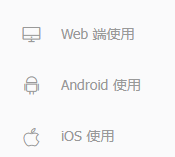
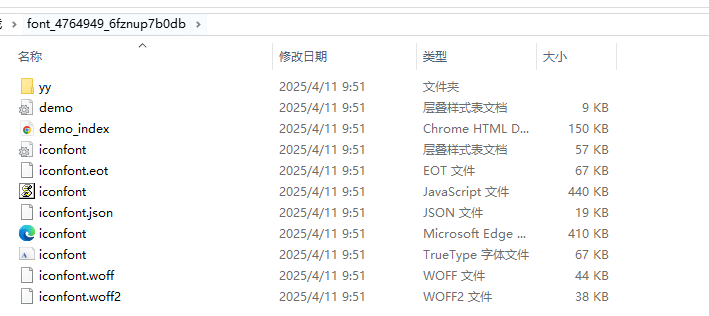
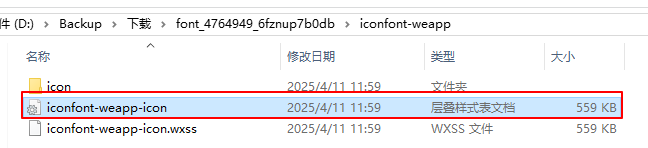
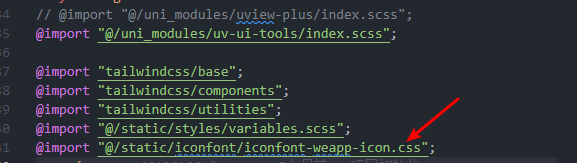

# Uniapp 踩坑记录

## 使用`uni.uploadFile`方法上传图片，提示`errMsg: "uploadFile:fail`

使用`uni.uploadFile`方法进行图片上传时，提示`errMsg: "uploadFile:fail`，图片上传失败，上传图片的接口根本就没有调用。

##### 解决方法

url 不能只传接口地址，要把完整的服务器地址拼接上去。

```js
url: `${envConfig.APP_SERVER_URL}/${backend.baseService}/api/ocrResource/s/ocrResource/fileUpld`,
```

##### 解决过程

虽然问题已经解决，并且解决的方法很简单，但是寻找整个问题解决办法的过程着实花费了不少时间，所以还是有必要记录一下解决的过程。

首先，接口没有调用，说明肯定是图片上传失败了，但是报错的信息目前还没有暴露出来，我们知道了有错误也无法定位到错误原因，只能再仔细看`uni.uploadFile` 的文档：

| 参数名  |     类型 | 必填 |          说明          |
| ------- | -------: | ---: | :--------------------: |
| success | Function |   否 | 接口调用成功的回调函数 |
| file    | Function |   否 | 接口调用失败的回调函数 |

加上`file`参数后，就可以看到报错的信息了：发现报错信息是`errMsg: "uploadFile:fail`

谷歌搜索了一番，有博客说`url`必须得填完整，于是把整个服务器地址拼接上去：

```js
url: `${envConfig.APP_SERVER_URL}${backend.baseService}/api/ocrResource/s/ocrResource/fileUpld`,
```

还是不行，报错信息还是`errMsg: "uploadFile:fail`

又搜索了一番，没有太大的收获，就在快要放弃的时候，发现自己的`url`少写了一个`/`...

```js
url: `${envConfig.APP_SERVER_URL}${backend.baseService}/api/ocrResource/s/ocrResource/fileUpld` // [!code --],
url: `${envConfig.APP_SERVER_URL}/${backend.baseService}/api/ocrResource/s/ocrResource/fileUpld` // [!code ++],
```

原来是自己的`url`少写了一个`/`，也就是说根本原因还是路径不完整，导致图片上传失败。

> 说实话`uniapp`的报错信息真是有点坑，无论是什么错误，都是`errMsg: "uploadFile:fail`，根本无法分辨出来是什么错误。
> 我们只能靠调试的方式，来寻找问题的原因。
> 如果说是`url`错误好歹返回一个相对应的错误信息呗....

这次解决问题的过程也给我个教训：

1. 如果有`fail`函数相关的错误处理函数，一定要处理，不要忽略，不然报错了也无法知道问题所在。
2. 不要过度相信报错信息，要确保自己代码的逻辑、变量的正确性。

## `uniapp`项目无法使用`iconfont`彩色图标

对于图标的使用，`iconfont`有三种方式`unicode`、`font-class`、`symbol`。如果我们引入的是彩色图标，那么只能使用`symbol`

实际在项目中使用了以下，根本行不通... 仔细一看`iconfont`的文档：



有`Web`端，有`Android`端，有`iOS`，并没有没有小程序项目

在网上搜索了下，有个叫`iconfont-tools`的工具可以用，这个工具可以将多色图标进行转换，下面就总结一下它的使用方法：

1. 下载图标库

   在`iconfont`中如何将我们想要的图标加入到我们的项目里就不多说了，直接快进到下载图标库，下载后解压，得到一个`iconfont`文件夹。



2. 安装`iconfont-tools`包

```js
npm install -g iconfont-tools
```

3. 执行命令

**在下载的字体文件目录下打开我们的终端**，执行`iconfont-tools`命令`，之后一路回车。

转化完之后我们原来的目录下会多一个`iconfont-weapp`文件夹，大致看下它的结构


4. `uniapp的使用`

在`uni-app`使用这些多色图标，只需要用到`iconfont-weapp-icon.css`这个文件，我们需要把这个文件放到到`uni-app`项目中去



之后在`App.vue`中引入这个文件即可



然后我们就可以在项目中去使用了，使用时只需要在元素上加上类名：`t-iconfont` + 图标名（比如`t-icon-yfic_ziyuanpinggu` ）

5. 更改多色图标的样式

仔细看下`iconfont-weapp-icon.css`文件

```css
.t-icon {
  display: inline-block;
  width: 16px;
  height: 16px;
  background-repeat: no-repeat;
  background-position: center;
  background-size: 100%;
}

.t-icon-yficon_audit-assessingtheproject {
  background: url(data:image/svg+xml,%3C%3Fxml%20version%3D%221.0%22%20encoding%3D%22utf-8%22%3F%3E%3Csvg%20version%3D%221.)...;
}
```

我们现在使用图标的原理其实是通过`background`来引入图标的，iconfont-tools 会把我们的图标转换成`svg`，之后`background`再来使用这个`svg`。
这样做的话有优点也有缺点，优点是这样做的的确确成功的在`uniapp`中引入了图标，缺点是，我们无法通过字体图标那样通过更改`font-size`来改变图标的大小，并且图标的颜色再也无法更改。

如果我们想更改某一个图标的大小，那么我们就需要针对这个图标重写`width`和`height`去覆盖掉原来的属性。

此外还有另外一个缺点：如果我们后续还需要引入其他的图标，我们必须重新获得`iconfont-weapp-icon.css`文件，为此还得再走一遍流程，
