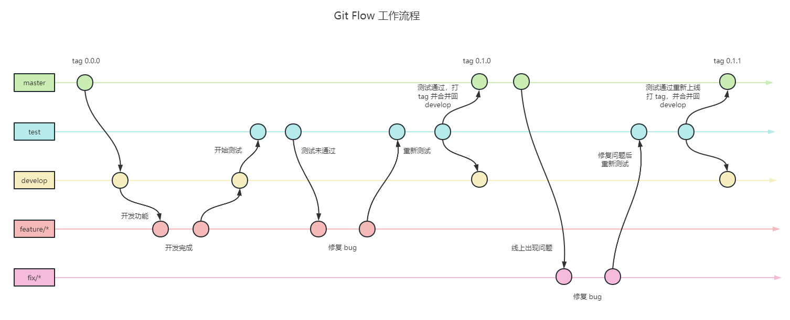
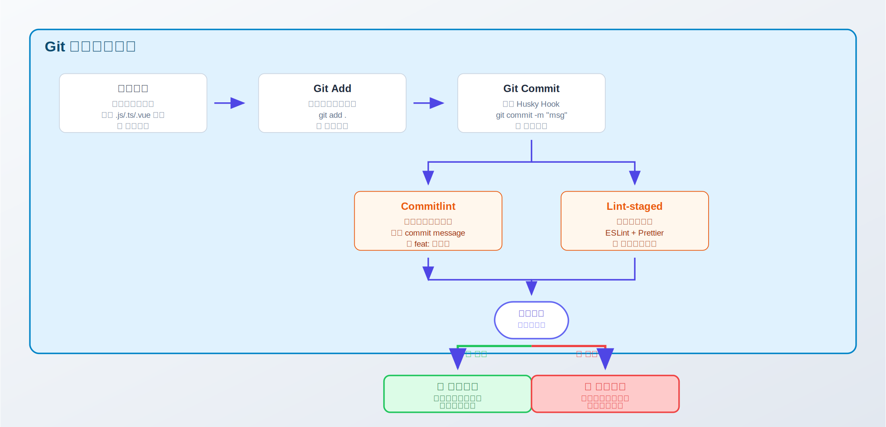

# 编码规范相关

## 序言

最近整理了一下自己在团队中实践并落地的编码规范相关内容，主要包含以下几类：

- **命名规范与项目结构规范**：如何为变量、函数、文件、目录制定清晰的命名规则
- **Git 提交规范**：如何通过规范的提交信息提高项目可追溯性
- **代码格式化工具**：如何利用 Prettier 等工具自动化统一代码风格
- **工作流相关**：如何保证规范能够被正确、稳定且便捷地使用

## 命名规范与项目结构规范

命名规范是编程规范中最重要的一部分，它直接影响到代码的可读性和可维护性

我们常见的命名形式有：

| 命名形式     | 示例        | 说明                         |
| ------------ | ----------- | ---------------------------- |
| `camelCase`  | `userName`  | 小驼峰式命名法（首字母小写） |
| `PascalCase` | `UserName`  | 大驼峰式命名法（首字母大写） |
| `snake_case` | `user_name` | 下划线命名法                 |
| `kebab-case` | `user-name` | 短横线命名法                 |
| `UPPER_CASE` | `USER_NAME` | 大写命名法                   |

### 文件命名规范

- 项目名称使用短横线命名法。🌰 `qianxun-notes`
- `html / css / md / js / ts / jsx / tsx` 文件使用短横线命名法
- `React / Vue` 组件文件使用大写驼峰式命名法。🌰 `Dialog.vue` / `Dialog.tsx`
- 静态资源文件使用短横线命名法。🌰 `logo-white.png`

### `JavaScript` 命名规范

- 常量使用大写命名法。🌰 `const MAX_COUNT = 1996`
- 正则常量命名使用后缀 `_RE`。🌰 `const PHONE_RE = /^1[3-9]\d{9}$/`
- 变量使用小驼峰式命名法。🌰 `const maxCount = 1996`
- `class` 类名使用大驼峰式命名法。🌰 `class User {}`
- 构造函数使用大驼峰式命名法。🌰 `function User() {}`
- 函数使用小驼峰式命名法。🌰 `function getUserInfo() {}`
- 对象 `key` 使用小驼峰式命名法。🌰 `const user = { userName: 'qianxun' }`
- 路由 `path` 使用短横线命名法。🌰 `path: '/user-info'`

### `CSS` 命名规范

- 类名使用短横线命名法。🌰 `.user-info`
- `ID` 使用小驼峰式命名法。🌰 `#userInfo`
- 自定义变量使用短横线命名法。🌰 `--main-color: #fff`

值得**注意**的是，命名规范也只是规范，也并不是说必须得强制执行，**有时也得灵活变动下**。比如说大家一般都很鄙视使用**拼音命名**，认为这种方式很`low`，但在某些情景下，由其是定义一些专业术语变量，我认为用汉语拼音反而比强行翻译成英文要好。

比如我们在写一个基建类项目，需要定义一个`路面机构层厚度`相关的变量，翻译成英文叫`Pavement structure layer thickness`，使用小驼峰命名法`pavementStructureLayerThickness`，嗯。。。属实有点反人类，写成缩写`PSLT`也有点抽象，定义成拼音`luMianJieGouCengHouDu`虽然不好看，但是矮子里面挑将军，对于熟悉项目的人来说，这种命名方式反而更能接受些。

### 项目结构规范

以下以一个通用的前端项目为例（目录结构可按技术栈微调）：

```sh
.
├── .vscode                           # VSCode 配置文件
├── public                            # 网站资源文件（favicon.ico index.html 等）
├── scripts                           # 脚本相关
├── src
│   ├── apis                          # api 接口
│   ├── assets                        # 静态资源
│   ├── components                    # 全局组件
│   ├── config                        # 项目配置文件
│   ├── constants                     # 常量
│   ├── hooks                         # 通用 hooks
│   ├── layout                        # 页面整体布局
│   ├── lib                           # 第三方或无业务依赖代码
│   ├── locales                       # i18n
│   ├── pages                         # 页面相关文件
│   │   ├── Home                      # 大驼峰规范 => 组件即是一个构造函数
│   │   │   ├── components            # 页面相关的子组件
│   │   │   ├── index.module.scss     # 根据应用的 CSS Scope 方案命名
│   │   │   └── index.tsx             # index 作为默认路径，视为根节点
│   │   └── App.tsx                   # 页面入口
│   ├── router                        # 页面路由
│   ├── store                         # 状态管理
│   ├── styles                        # 全局/基础样式
│   ├── types                         # TypeScript 类型声明
│   ├── utils                         # 工具函数
│   └── main.tsx                      # 应用启动入口
├── README.md                         # 当前项目的文档
├── package.json                      # 项目信息
└── tsconfig.json                     # TypeScript 配置文件
```

有两点需**要注意**：

1. 上面规范也只是参考，**不同语言的项目结构规范不一样**，甚至`vue2`与`vue3`都不太一样，但是核心思想都大差不差
2. 项目结构规范由其适用于**约定大于规范**这句话，如果是维护的老项目，尽量不要随着自己心意更改整个项目结构，不要随便增加或者更改结构文件夹，~~否则可能会迎来队友的痛击~~

## Git 相关规范

### 分支管理规范

主要是对分支的命名与管理做约定。

**命名**

分支命名建议使用 `feature/xxx-xxx` 或 `fix/xxx-xxx` 的格式，单词之间用短横线 `-` 连接。

**分支管理**

项目需要根据环境的不同创建对应的分支，通常有下面五种分支：

- `master` - 生产环境分支，只接受来自 `develop` 的合并
- `develop` - 开发环境分支，所有功能开发的基础分支
- `test` - 测试环境分支，用于部署测试版本
- `feature/xxx` - 功能分支，用于开发新功能
- `fix/xxx` - 修复分支，用于修复 `bug`

**Git 相关工作流规范**

`Git`相关工作流规范，网上的版本其实非常多，贴一个我比较常用的 `Git Flow` 流程图，和主流常用的大同小异：



**开发新功能时**：当团队成员开发新功能时，需要从 `develop` 分支上拉一个 `feature/功能名称` 分支进行开发，例如：`feature/login`。开发完成后需要合并到 `test` 分支进行部署测试，如果测试未通过，继续在`feature/功能名称`上开发，如果测试通过，合并到`develop`，`develop`再合并到`master`

**修复 Bug 时**：当线上出现`bug`时，从`master`分支上拉一个`fix/修复功能名称`分支进行开发，例如`fix/upload`。开发完成后也需要合并到 `test` 分支进行部署测试，测试通过，合并到`develop`和`master`

值得一提的是，我这个是简化过后的，适用于我们自己项目的`Git Flow`。当前各个公司流行的`Git Flow`很多都是延伸自`Vincent Driessen`在`2010`年写的一篇文章[A successful Git branching model](https://nvie.com/posts/a-successful-git-branching-model/)，网上也有很多文章对此进行了详细的解读，有兴趣的也可以搜索看下。

### Git 提交规范

深究的话，提交规范的要求还挺高的，它的大致结构为`git commit message`要求填写五项内容：

```sh
type>(<scope>): <subject>

<body>

<footer>

```

- `type`（必填）：`commit` 的类型
- `scope`（选填）：`commit` 的影响范围
- `subject`（必填）：`commit` 信息的简短描述（50 字以内）
- `body`（选填）：`commit` 信息的具体描述
- `footer`（选填）：重大变化（`Breaking Change`）和需要关闭的`Issue`

但是就我自己实践并结合我在团队中推行规范的情况来看，大部分人~~包括我自己~~其实能写清楚`type`就不错了。通常我们的项目开发周期非常快，`git`提交的频率很高，提交一个`commit`就得写真么多东西在快节奏开发中属实有点不太现实。但是规范下提交的`type`还是很有必要的，一个合理的`type`能够帮助我们大致识别出来这个提交是干嘛的。

**commit 常用 type：**

|       type       | 含义                                   |
| :--------------: | :------------------------------------- |
|      _feat_      | 新功能                                 |
|      _fix_       | 修复 bug                               |
|      _docs_      | 文档类改动                             |
|     _style_      | 代码格式改动，同理适用于业务样式调整   |
|    _refactor_    | 重构（即不是新增功能，也不是修复 bug） |
|      _perf_      | 性能优化相关                           |
|     _types_      | `TypeScript` 类型相关的改动            |
|      _test_      | 单元测试、e2e 测试                     |
|     _build_      | 构建工具或者依赖项的改动               |
|       _ci_       | 修改项目持续集成流程                   |
|     _chore_      | 其他类型的提交                         |
|     _revert_     | 恢复或还原相关提交                     |
| _wip_ \| _draft_ | 托管平台对应的草稿标识                 |

## 代码格式化

代码格式化可以保证团队成员有一致的编码风格，最常用的格式化工具应该就属`prettier`了

下面是一些我自己的`prettier`规范

```js
/**
 * Prettier 配置项
 * https://prettier.io/docs/en/options.html
 */
module.exports = {
  // 一行最多 100 字符
  printWidth: 100,
  // 使用 2 个空格缩进
  tabWidth: 2,
  // 不使用缩进符，而使用空格
  useTabs: false,
  // 行尾需要有分号
  semi: true,
  // 使用双引号
  singleQuote: false,
  // 对象的 key 仅在必要时用引号
  quoteProps: "as-needed",
  // jsx 不使用单引号，而使用双引号
  jsxSingleQuote: false,
  // es5有效的地方保留逗号
  trailingComma: "es5",
  // 大括号内的首尾需要空格
  bracketSpacing: true,
  // jsx 标签的反尖括号需要换行
  jsxBracketSameLine: false,
  // 箭头函数，只有一个参数的时候，也需要括号
  arrowParens: "always",
  // 每个文件格式化的范围是文件的全部内容
  rangeStart: 0,
  rangeEnd: Infinity,
  // 不需要写文件开头的 @prettier
  requirePragma: false,
  // 不需要自动在文件开头插入 @prettier
  insertPragma: false,
  // 使用默认的折行标准
  proseWrap: "preserve",
  // 根据显示样式决定 html 要不要折行
  htmlWhitespaceSensitivity: "css",
  // 换行符使用 lf
  endOfLine: "lf",
};
```

需要提醒的是，对老项目，千万不要手贱对所有文件都格式化了，要不然就会出现所有文件的最新更改记录都是自己这种尴尬情况，~~~反正我没干过~~~

代码格式化相关的还有`eslint`这种静态检查工具，不过我不太喜欢，这里就不展开说了。需要注意的是，如果使用了`eslint`，需要处理好它与`prettier`的检测冲突问题，网上这种文章很多，有兴趣可以搜索看下。

## 工作流相关

规范制定好了，还需要确保“被正确执行”。现实中常见的问题包括：

对于老项目，还需要做其他东西

代码格式化

- 某些人提交`Git`的时候就是不按照定义的规范来，比如随意写个`commit`就提交上去了
- 团队中有人已经设置过了自己的`prettier`规范，或者某些人的`保存并开启格式化`功能并没有开启，设置了`prettier`可能也不起作用

这时候我们期望有一系列的工具，可以帮助我们解决以下问题：

1. 提交`Git`的时候检查`commit`格式，不符合格式的不允许提交
2. 提交时对提交文件自动进行`prettier`格式化，这样做可以只对提交文件进行格式化

我们可以用以下工具实现我们想要的效果：

1. [husky](https://github.com/typicode/husky)：`Git Hooks` 工具，在提交、推送等时机执行脚本
2. [commitlint](https://github.com/conventional-changelog/commitlint)：校验 `commit message`是否符合规范
3. [lint-staged](https://github.com/lint-staged/lint-staged)：仅对暂存文件运行 `ESLint/Prettier`

它们的协作流程如下图：



在执行 `git commit` 时，`husky` 会触发相应的钩子，进而：

- 调用 `commitlint` 校验提交信息格式
- 调用 `lint-staged` 对暂存文件运行 `ESLint/Prettier`

当两者都通过后，提交才会被允许进入仓库。

以上工具相关的配置可以去网上搜索下，然后根据自己的项目所需进行配置，想懒省事也可以看下我开发的两个小工具：
[@fe-qianxun/verify-commit](https://www.npmjs.com/package/@fe-qianxun/verify-commit) 和 [@fe-qianxun/prettier](https://www.npmjs.com/package/@fe-qianxun/prettier)

## 相关链接

- [我的博客](https://docs.fe-qianxun.com/)
- [Conventional Commits | GitHub](https://github.com/conventional-commits/conventionalcommits.org)
- [Angular convention | Github](https://github.com/angular/angular/blob/22b96b9/CONTRIBUTING.md#-commit-message-guidelines)
- [A successful Git branching model](https://nvie.com/posts/a-successful-git-branching-model/)

> 💡 **提示**：编程规范不是限制创造力的枷锁，而是提升代码质量的工具。好的规范应该让开发者专注于业务逻辑的实现，而不是纠结于代码格式的细节。
